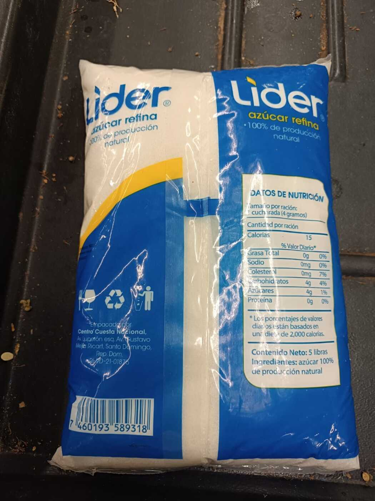
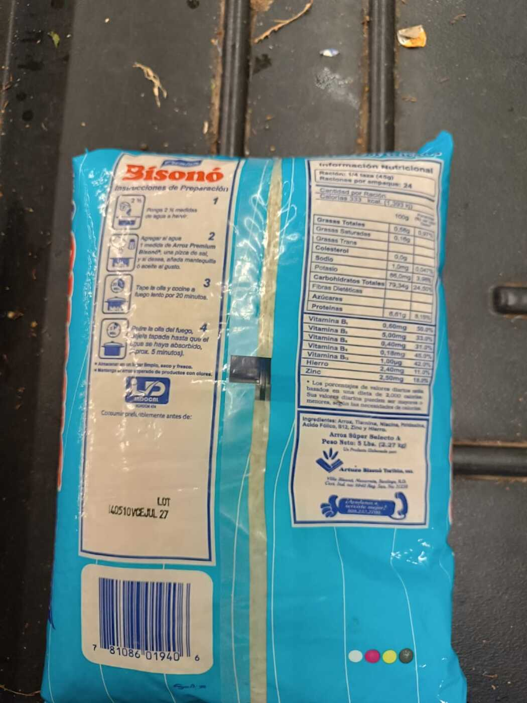
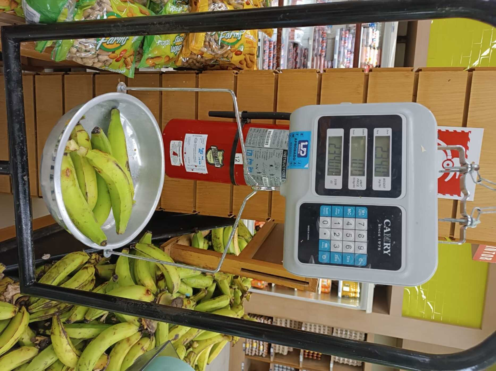

```{r}
#| label: setup

# Esta presentación no calcula nada: lee las salidas del pipeline. Si falta un
# archivo, se detiene indicando qué script lo genera.
ruta_comun <- c(here::here("reports", "_comun.R"),
                here::here("scripts", "_comun.R"))
source(ruta_comun[file.exists(ruta_comun)][1])

library(ggplot2)

AZUL <- "#2c5364"; AZUL_C <- "#7ba3bd"; GRIS <- "#c9d3da"; ACENTO <- "#c0623c"

tema <- function(base = 16) {
  theme_minimal(base_size = base) +
    theme(panel.grid.minor   = element_blank(),
          panel.grid.major.x = element_blank(),
          panel.grid.major.y = element_line(colour = "#eef2f4"),
          axis.title  = element_text(colour = "#5a6b76", size = rel(0.85)),
          plot.title  = element_text(face = "bold", colour = "#1a3a4a", size = rel(0.95)),
          legend.position = "none")
}

leer_clean <- function(archivo, script) {
  f <- file.path(RUTA_CLEAN, archivo)
  exigir_archivo(f, script)
  leer_limpio(f)
}

esc <- leer_clean("escenarios_resumen.csv",           "06_escenarios_fortificacion.R")
veh <- leer_clean("escenarios_consumo_vehiculos.csv", "06_escenarios_fortificacion.R")
rie <- leer_clean("riesgo_inadecuacion.csv",          "07_riesgo_inadecuacion.R")
gru <- leer_clean("grupos_alimentos.csv",             "08_grupos_alimentos.R")

entregables <- leer_limpio(file.path(RUTA_RAW, "entregables_estado.csv")) |>
  arrange(orden)
auditoria <- leer_limpio(here::here("data", "auditoria",
                                    "verificacion_punto_venta_2026-10-04.csv"))

# Escenarios citados en el texto. Si alguno cambia de nombre, la presentación
# se detiene en lugar de mostrar una cifra equivocada.
E_SIN   <- "0. Sin fortificación"
E_BASE  <- "1a. Norma nacional: harina y pan"
E_TODOS <- "1b. Norma nacional: harina y todos los derivados"
E_ARROZ <- "3. Norma nacional y arroz (propuesta nacional)"
faltan <- setdiff(c(E_SIN, E_BASE, E_TODOS, E_ARROZ), unique(esc$escenario))
if (length(faltan) > 0) {
  stop("Escenarios ausentes en escenarios_resumen.csv: ",
       paste(faltan, collapse = "; "), call. = FALSE)
}

# Rótulos cortos para las figuras. La correspondencia se comprueba: si aparece
# un escenario nuevo sin rótulo, se detiene.
ROTULOS <- tibble::tribble(
  ~escenario, ~corto,
  E_SIN,   "Sin\nfortificar",
  E_BASE,  "Norma:\nharina y pan",
  E_TODOS, "Norma: todos\nlos derivados",
  "1c. Norma nacional y azúcar",                         "Norma\n+ azúcar",
  "2a. OMS: harina y derivados, consumo menor de 75 g",  "OMS\n(<75 g)",
  "2b. OMS: harina y derivados, consumo de 75 a 149 g",  "OMS\n(75–149 g)",
  E_ARROZ, "Norma\n+ arroz"
)
sin_rotulo <- setdiff(unique(esc$escenario), ROTULOS$escenario)
if (length(sin_rotulo) > 0) {
  stop("Escenarios sin rótulo corto: ", paste(sin_rotulo, collapse = "; "),
       call. = FALSE)
}
corto <- function(x) ROTULOS$corto[match(x, ROTULOS$escenario)]
ORDEN_CORTO <- corto(c(E_SIN, sort(setdiff(unique(esc$escenario), E_SIN))))

# --- Extractores: una sola fila o error ---------------------------------------

# Riesgo de ingesta inadecuada a nivel nacional, con todos los hogares.
riesgo_nac <- function(escenario_, nutriente_, metodo_ = "Punto de corte") {
  v <- rie |>
    filter(dominio == "Nacional", hogares == "Todos", escenario == escenario_,
           nutriente == nutriente_, metodo == metodo_) |>
    pull(pct_inadecuado)
  if (length(v) != 1) {
    stop("Riesgo no identificado para ", escenario_, " / ", nutriente_,
         " / ", metodo_, " (", length(v), " filas).", call. = FALSE)
  }
  v
}

# Ingesta mediana por EMA y día.
mediana_esc <- function(escenario_, nutriente_) {
  v <- esc |> filter(escenario == escenario_, nutriente == nutriente_) |> pull(mediana)
  if (length(v) != 1) {
    stop("Mediana no identificada para ", escenario_, " / ", nutriente_, ".",
         call. = FALSE)
  }
  v
}

# Razón entre el quintil de mayor y el de menor gasto.
razon_esc <- function(escenario_) {
  v <- esc |> filter(escenario == escenario_) |> distinct(razon_q5_q1) |> pull()
  if (length(v) != 1) stop("Razón Q5/Q1 no identificada para ", escenario_, ".",
                           call. = FALSE)
  v
}

consumo_veh <- function(grupo_, columna) {
  v <- veh |> filter(grupo == grupo_) |> pull({{ columna }})
  if (length(v) != 1) stop("Vehículo no identificado: ", grupo_, ".", call. = FALSE)
  v
}

HOGARES <- max(rie$n, na.rm = TRUE)
HORAS   <- sum(entregables$horas_est, na.rm = TRUE)
```

## Lo que se preguntó y lo que se encontró

::: {style="font-size:0.95em;"}
**¿Permite la ENGIH 2018 estimar el aporte de los alimentos fortificados a la
ingesta de micronutrientes?** Sí, con adaptaciones documentadas.
`r format(HOGARES, big.mark = ".")` hogares entran al cálculo.
:::

<br>

::: {.columns}
::: {.column width="33%"}
**El alcance ya existe**

Los vehículos llegan a casi todos los hogares: arroz
**`r fmt(consumo_veh("Arroz", pct_hogares), 0)`%**, trigo
**`r fmt(consumo_veh("Trigo, en equivalentes de harina", pct_hogares), 0)`%**.
:::
::: {.column width="33%"}
**La norma vigente no agota el margen**

Bajo el requerimiento de folato: **`r fmt(riesgo_nac(E_BASE, "folato_mcg_dfe"))`%**
con la norma de harina; **`r fmt(riesgo_nac(E_ARROZ, "folato_mcg_dfe"))`%**
añadiendo el arroz.
:::
::: {.column width="33%"}
**El vehículo decide quién se beneficia**

Razón de ingesta de folato entre quintiles extremos:
**`r fmt(razon_esc(E_BASE), 2)`** con harina, **`r fmt(razon_esc(E_ARROZ), 2)`**
con arroz.
:::
:::

::: {.notapie}
**NOTA:** Estimaciones ponderadas con el diseño muestral complejo de la encuesta (8 estratos, 933 unidades primarias de muestreo, factor de expansión por hogar). Los valores de referencia son provisionales. EMA: Equivalente de Mujer Adulta.
:::

## Estado de los productos

```{r}
#| label: tbl-entregables
#| tbl-cap: "Grado de avance de los productos comprometidos en los términos de referencia. Consultoría ENGIH 2018"

entregables |>
  transmute(
    Producto = entregable,
    `TdR`    = tdr,
    Avance   = paste0(strrep("█", round(avance_pct / 10)),
                      strrep("·", 10 - round(avance_pct / 10)),
                      "  ", avance_pct, "%"),
    Situación = estado
  ) |>
  tabla(fuente = paste("Fuente: términos de referencia de la consultoría y",
                       "registro de avance del repositorio del proyecto."),
        notas = "TdR: numeral de los términos de referencia.")
```

# 1 · Avances del análisis {background-color="#2c5364"}

## Qué consume el país

```{r}
#| label: fig-vehiculos
#| fig-cap: "Hogares que adquieren cada vehículo de fortificación y consumo mediano entre quienes lo adquieren, por Equivalente de Mujer Adulta y día. República Dominicana, 2018"
#| fig-width: 10.5
#| fig-height: 3.8

veh |>
  mutate(grupo = reorder(grupo, pct_hogares)) |>
  ggplot(aes(pct_hogares, grupo)) +
  geom_segment(aes(x = 0, xend = pct_hogares, yend = grupo),
               colour = GRIS, linewidth = 1.6) +
  geom_point(colour = AZUL, size = 4.4) +
  geom_text(aes(label = paste0(fmt(mediana_consumidores, 0), " g")),
            hjust = -0.45, size = 4.1, colour = "#44555f") +
  scale_x_continuous(limits = c(0, 118), breaks = seq(0, 100, 25),
                     labels = function(x) paste0(x, "%")) +
  labs(x = "Hogares que lo adquieren (%)", y = NULL) +
  tema()
```

::: {.notapie}
**NOTA:** La cifra a la derecha de cada punto es el consumo mediano entre los hogares que adquieren el vehículo, en gramos por EMA y día. El trigo se expresa en equivalentes de harina: pan, pastas, galletas y repostería convertidos a gramos de harina con factores de contenido provisionales. Estimaciones ponderadas con el diseño muestral complejo de la encuesta (8 estratos, 933 unidades primarias de muestreo, factor de expansión por hogar). EMA: Equivalente de Mujer Adulta.
:::

## De dónde viene la energía

```{r}
#| label: fig-grupos
#| fig-cap: "Aporte de cada grupo de alimentos a la energía adquirida por el hogar y hogares que lo adquieren en la semana de referencia. República Dominicana, 2018"
#| fig-width: 10.5
#| fig-height: 4

gru |>
  slice_max(pct_energia, n = 10) |>
  mutate(grupo_mddw = reorder(sub("^[0-9]{2} ", "", grupo_mddw), pct_energia)) |>
  ggplot(aes(pct_energia, grupo_mddw)) +
  geom_col(fill = AZUL_C, width = 0.68) +
  geom_text(aes(label = paste0(fmt(pct_energia), "%  ·  ",
                               fmt(pct_hogares, 0), "% de los hogares")),
            hjust = -0.05, size = 3.5, colour = "#44555f") +
  scale_x_continuous(expand = expansion(mult = c(0, 0.42)),
                     labels = function(x) paste0(x, "%")) +
  labs(x = "Aporte a la energía adquirida (%)", y = NULL) +
  tema(13)
```

::: {.notapie}
**NOTA:** Clasificación de grupos de alimentos de la guía de diversidad dietética mínima en mujeres (FAO, 2021), aplicada a la agrupación propia de las 799 variedades de la encuesta en 133 alimentos. Los grupos no son el indicador de diversidad dietética: la encuesta mide adquisición del hogar en una semana, no consumo individual en 24 horas. Estimaciones ponderadas con el factor de expansión de la encuesta.
:::

## Qué cambia según qué se fortifique

```{r}
#| label: fig-escenarios
#| fig-cap: "Ingesta mediana de hierro y folato por Equivalente de Mujer Adulta y día, según escenario de fortificación. República Dominicana, 2018"
#| fig-width: 11
#| fig-height: 3.7

esc |>
  filter(nutriente %in% c("hierro_mg", "folato_mcg_dfe")) |>
  mutate(escenario = factor(corto(escenario), levels = ORDEN_CORTO),
         nutriente = factor(nutriente, c("hierro_mg", "folato_mcg_dfe"))) |>
  ggplot(aes(escenario, mediana)) +
  geom_col(fill = AZUL_C, width = 0.55) +
  geom_text(aes(label = fmt(mediana, 0)), vjust = -0.4, size = 3.7,
            colour = "#44555f") +
  scale_y_continuous(expand = expansion(mult = c(0, 0.22))) +
  facet_wrap(~nutriente, scales = "free_y",
             labeller = as_labeller(c(hierro_mg = "Hierro (mg)",
                                      folato_mcg_dfe = "Folato (µg DFE)"))) +
  labs(x = NULL, y = NULL) +
  tema(13) +
  theme(strip.text  = element_text(face = "bold", colour = "#1a3a4a"),
        axis.text.x = element_text(size = rel(0.82), lineheight = 0.95))
```

::: {.notapie}
**NOTA:** Cada escenario parte del alimento sin fortificar y añade el nivel de la norma correspondiente, expresado en miligramos por kilogramo de vehículo. Los niveles de la propuesta nacional de reglamento de arroz se tomaron de una presentación y están pendientes de confirmación documental. EMA: Equivalente de Mujer Adulta. DFE: equivalentes dietéticos de folato. OMS: Organización Mundial de la Salud.
:::

## Riesgo de ingesta inadecuada

```{r}
#| label: fig-riesgo
#| fig-cap: "Hogares con ingesta por Equivalente de Mujer Adulta bajo el requerimiento promedio estimado, según nutriente y escenario de fortificación. República Dominicana, 2018"
#| fig-width: 10.5
#| fig-height: 3.9

ETIQ_NUT <- c(folato_mcg_dfe     = "Folato",
              hierro_mg          = "Hierro",
              vitamina_a_mcg_rae = "Vitamina A",
              zinc_mg            = "Zinc",
              vitamina_b12_mcg   = "Vitamina B12")

pend <- rie |>
  filter(dominio == "Nacional", hogares == "Todos",
         escenario %in% c(E_SIN, E_BASE, E_ARROZ),
         metodo %in% c("Punto de corte", "Probabilidad, biodisponibilidad 10%"),
         nutriente %in% names(ETIQ_NUT)) |>
  mutate(escenario = factor(corto(escenario),
                            levels = corto(c(E_SIN, E_BASE, E_ARROZ))),
         nut = ETIQ_NUT[nutriente])

ggplot(pend, aes(escenario, pct_inadecuado, group = nut)) +
  geom_line(colour = AZUL_C, linewidth = 1.1) +
  geom_point(colour = AZUL, size = 3) +
  geom_text(data = pend |> filter(escenario == last(levels(pend$escenario))),
            aes(label = paste0(" ", nut, ": ", fmt(pct_inadecuado, 0), "%")),
            hjust = 0, size = 3.9, colour = "#44555f") +
  scale_y_continuous(limits = c(0, 100), labels = function(x) paste0(x, "%")) +
  scale_x_discrete(expand = expansion(mult = c(0.08, 0.52))) +
  labs(x = NULL, y = "Hogares bajo el requerimiento (%)") +
  tema(14) +
  theme(axis.text.x = element_text(lineheight = 0.95))
```

::: {.notapie}
**NOTA:** Método del punto de corte del requerimiento promedio estimado, salvo en hierro, donde se aplica el enfoque de probabilidad con la distribución del requerimiento y un supuesto de 10% de biodisponibilidad. **Valores de referencia provisionales: no citables.** Estas cifras no son prevalencia de deficiencia: la ingesta es aparente, a nivel de hogar, y el reparto dentro del hogar se supone proporcional al requerimiento energético. Ácido fólico añadido sobre el límite superior tolerable: `r fmt(esc |> filter(escenario == E_ARROZ) |> distinct(pct_folico_sobre_ul) |> pull())`% en el escenario con arroz. EMA: Equivalente de Mujer Adulta.
:::

## El vehículo decide quién se beneficia

```{r}
#| label: fig-equidad
#| fig-cap: "Ingesta mediana de folato por Equivalente de Mujer Adulta y día en los quintiles extremos de gasto del hogar, según escenario de fortificación. República Dominicana, 2018"
#| fig-width: 10.5
#| fig-height: 3.8

eq <- esc |>
  distinct(escenario, folato_q1, folato_q5, razon_q5_q1) |>
  mutate(etq = factor(corto(escenario), levels = rev(ORDEN_CORTO)))

ggplot(eq, aes(y = etq)) +
  geom_segment(aes(x = folato_q1, xend = folato_q5, yend = etq),
               colour = GRIS, linewidth = 1.6) +
  geom_point(aes(x = folato_q1), colour = AZUL, size = 3.6) +
  geom_point(aes(x = folato_q5), colour = ACENTO, size = 3.6) +
  geom_text(aes(x = folato_q5, label = paste0("  razón ", fmt(razon_q5_q1, 2))),
            hjust = 0, size = 3.7, colour = "#44555f") +
  scale_x_continuous(expand = expansion(mult = c(0.04, 0.26))) +
  labs(x = "Folato (µg DFE por EMA y día)", y = NULL) +
  tema(14) +
  theme(axis.text.y = element_text(lineheight = 0.95))
```

::: {.notapie}
**NOTA:** Punto azul: quintil de menor gasto. Punto anaranjado: quintil de mayor gasto. La razón es el cociente entre ambas medianas; un valor cercano a 1 indica que el vehículo alcanza por igual a los dos extremos de la distribución del gasto. El quintil es el de la propia encuesta. Estimaciones ponderadas con el diseño muestral complejo de la encuesta (8 estratos, 933 unidades primarias de muestreo, factor de expansión por hogar). EMA: Equivalente de Mujer Adulta. DFE: equivalentes dietéticos de folato.
:::

## Lo que dice la etiqueta

::: {.columns}
::: {.column width="27%"}

:::
::: {.column width="27%"}

:::
::: {.column width="46%"}
::: {style="font-size:0.92em;"}
Verificación en punto de venta, **`r sum(auditoria$tipo == "etiqueta")` etiquetas**
de un establecimiento en un día.

<br>

**El azúcar no declara vitamina A.** Ingrediente único: azúcar. El escenario de
azúcar es, por ahora, una norma sin aplicación verificada.

<br>

**El arroz se vende ya fortificado** con siete nutrientes, por encima de
cualquier norma vigente. El escenario de arroz no es hipotético: describe un
producto que está en el estante.
:::
:::
:::

::: {.notapie}
**NOTA:** Un establecimiento, un día; no es una muestra representativa del mercado. Registro completo en `data/auditoria/verificacion_punto_venta_2026-10-04.csv`.
:::

# 2 · Problemas encontrados y cómo se resolvieron {background-color="#2c5364"}

## Medir lo que la encuesta no publica

::: {.columns}
::: {.column width="40%"}

:::
::: {.column width="60%"}
::: {style="font-size:0.9em;"}
**El problema.** La encuesta registra plátano, guineo y aguacate en unidades,
no en gramos. Sin peso por unidad, 16.400 observaciones quedaban fuera.

<br>

**La solución.** Pesaje directo en punto de venta de
**`r sum(auditoria$tipo == "pesaje")` alimentos**, con fotografía de cada
lectura.

<br>

**La comprobación que cambió un resultado.** La balanza marcaba libras, no
kilogramos. Un factor cargado en septiembre estaba sobreestimado 2,2 veces.
Se verificó por una vía independiente —los precios implícitos de la propia
encuesta, precio por unidad entre precio por libra— y se corrigió.
:::
:::
:::

::: {.notapie}
**NOTA:** Registro y fotografías en `data/auditoria/verificacion_punto_venta_2026-10-04.csv`. Un establecimiento, un día.
:::

## Cuatro decisiones metodológicas

::: {style="font-size:0.82em;"}
**1 · Doble conteo entre las dos secciones.** La Sección 2 registra existencias
y la 3A, adquisiciones diarias. Se comprobó que la pregunta de consumo de la
Sección 2 equivale a inventario inicial menos final en el **98,3%** de las
filas. Se adoptó una regla de agotamiento: si al día 8 queda existencia inicial
de un alimento almacenable, lo adquirido esa semana se trata como almacenado y
no se cuenta.

**2 · La línea base no estaba sin fortificar.** Las entradas de pan, pastas y
galletas de la tabla de composición se elaboran con harina ya enriquecida. El
escenario «sin fortificar» de la versión de septiembre no lo era, y la
conclusión de que fortificar la harina apenas movía la ingesta era un artefacto.
Se sustituyó por un método aditivo: se parte del alimento sin fortificar y se
añade el nivel de la norma en miligramos por kilogramo.

**3 · Hogares con energía implausible.** 847 hogares quedan fuera del rango de
500 a 6.000 kcal por EMA y día. Excluirlos no es neutral: afecta al 6,0% del
quintil de menor gasto y al 16,5% del de mayor gasto. Se marcan, no se excluyen,
y todo resultado se reporta con y sin ellos.

**4 · Vacíos en la tabla de composición.** 278 valores completados con fuente
documentada, y vitamina B12 y vitamina D en cero para alimentos vegetales sin
procesar. Cobertura en gramos: hierro 96,9%, folato 93,4%.
:::

## Lo que queda abierto

::: {style="font-size:0.88em;"}
Ninguna de estas cuatro decisiones es reversible sin recalcular. Las tres que
siguen sí condicionan las cifras que se publiquen:

- **Valores de referencia.** Los actuales son del Instituto de Medicina para
  mujeres de 19 a 30 años, provisionales. Cambiarlos es sustituir un archivo;
  cambia todas las cifras de riesgo.
- **Biodisponibilidad del hierro.** Con 10% el riesgo es
  `r fmt(riesgo_nac(E_BASE, "hierro_mg", "Probabilidad, biodisponibilidad 10%"))`%;
  con 18%,
  `r fmt(riesgo_nac(E_BASE, "hierro_mg", "Probabilidad, biodisponibilidad 18%"))`%.
  Es el supuesto más influyente del análisis.
- **Fracciones de harina** en pan, pastas y galletas: en uso, sin fuente citable.
:::

::: {.notapie}
**NOTA:** Las decisiones adoptadas y su justificación están registradas en `docs/hoja-de-ruta.md`, con fecha y efecto sobre las cifras.
:::

## Para qué sirve esto después

::: {style="font-size:0.88em;"}
**Lo que es reutilizable.** El procedimiento está dividido en ocho etapas
numeradas, cada una con su salida en disco. Los parámetros no están en el
código: norma de fortificación, valores de referencia, agrupación de alimentos
y vehículos viven en archivos editables. Cambiar de referencia o de escenario
es sustituir un archivo, no reescribir un programa.

**Lo que conecta con el trabajo de la organización.** La salida es la que pide
un análisis de riesgo de ingesta inadecuada: consumo aparente por Equivalente
de Mujer Adulta, riesgo por nutriente y por dominio de estimación, y escenarios
de fortificación comparables entre sí.

**Lo que no es transferible.** La tabla puente entre la encuesta y la tabla de
composición, la agrupación de alimentos y los factores de conversión son
específicos de la ENGIH. Otra encuesta exige rehacerlos: cambian la estructura,
las variables y el sistema de clasificación. El código lo advierte donde
corresponde.
:::

# 3 · Cierre {background-color="#2c5364"}

## Qué falta y en cuánto tiempo

```{r}
#| label: tbl-pendiente
#| tbl-cap: "Trabajo pendiente por producto y tiempo estimado de dedicación. Consultoría ENGIH 2018"

entregables |>
  filter(horas_est > 0) |>
  transmute(Producto = entregable,
            `Qué falta` = falta,
            `Horas` = horas_est) |>
  tabla(fuente = "Fuente: registro de avance del repositorio del proyecto.",
        notas = paste0("Estimación de dedicación propia, no de calendario. ",
                       "Total: ", HORAS, " horas."))
```

## Lo que se pide decidir

::: {style="font-size:0.9em;"}
1. **Valores de referencia definitivos.** ¿Se mantienen los del Instituto de
   Medicina o se adoptan los armonizados del proyecto de referencia? Condiciona
   toda la sección de riesgo.
2. **Biodisponibilidad del hierro.** Fijar el supuesto, o publicar las dos
   estimaciones como rango.
3. **Alcance del escenario de arroz.** La propuesta nacional de reglamento se
   tomó de una presentación. ¿Se consigue el documento, o se reporta solo como
   análisis de sensibilidad?
4. **Prioridad entre productos.** Con el tiempo disponible, el análisis y el
   informe final pueden quedar completos; los módulos de capacitación, en
   cumplimiento mínimo. Se pide confirmar ese orden.
:::

::: {.notapie}
**NOTA:** Las tres primeras decisiones afectan a cifras ya calculadas y pueden aplicarse sustituyendo archivos de parámetros, sin reescribir el análisis.
:::

## Fuentes

::: {style="font-size:0.78em;"}
Banco Central de la República Dominicana. *Encuesta Nacional de Gastos e
Ingresos de los Hogares 2018.*

Instituto de Nutrición de Centro América y Panamá. *Tabla de composición de
alimentos de Centroamérica.*

United States Department of Agriculture. *Food and Nutrient Database for
Dietary Studies.*

Institute of Medicine. *Dietary Reference Intakes: the essential guide to
nutrient requirements.* Washington: National Academies Press.

Organización Mundial de la Salud. *Recommendations on wheat and maize flour
fortification.* Ginebra, 2009.

Organización de las Naciones Unidas para la Alimentación y la Agricultura.
*Minimum dietary diversity for women: an updated guide.* Roma, 2021.

Reglamento Técnico Dominicano RTD 616, enriquecimiento de la harina de trigo.
Norma Dominicana NORDOM 602, azúcar fortificada con vitamina A.
:::
