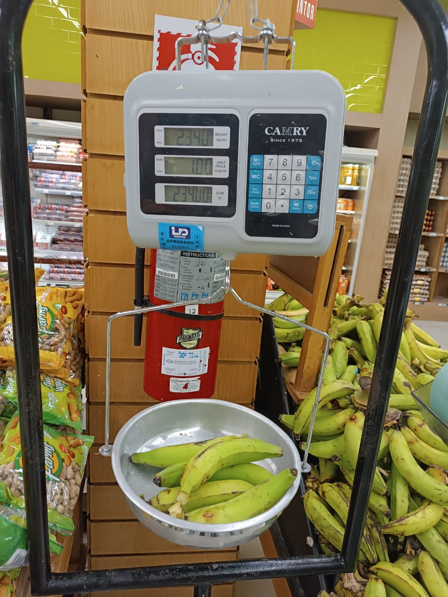

```{r}
#| label: setup

# Esta presentación no calcula resultados: lee las salidas del pipeline. Si
# falta un archivo, se detiene indicando qué script lo genera.
ruta_comun <- c(here::here("reports", "_comun.R"),
                here::here("scripts", "_comun.R"))
source(ruta_comun[file.exists(ruta_comun)][1])

library(ggplot2)

AZUL <- "#2c5364"; AZUL_C <- "#7ba3bd"; GRIS <- "#c9d3da"; ACENTO <- "#c0623c"

tema <- function(base = 16) {
  theme_minimal(base_size = base) +
    theme(panel.grid.minor   = element_blank(),
          panel.grid.major.x = element_blank(),
          panel.grid.major.y = element_line(colour = "#eef2f4"),
          axis.title  = element_text(colour = "#5a6b76", size = rel(0.85)),
          plot.title  = element_text(face = "bold", colour = "#1a3a4a", size = rel(0.95)),
          legend.position = "none")
}

leer_clean <- function(archivo, script) {
  f <- file.path(RUTA_CLEAN, archivo)
  exigir_archivo(f, script)
  leer_limpio(f)
}

esc <- leer_clean("escenarios_resumen.csv",           "06_escenarios_fortificacion.R")
veh <- leer_clean("escenarios_consumo_vehiculos.csv", "06_escenarios_fortificacion.R")
rie <- leer_clean("riesgo_inadecuacion.csv",          "07_riesgo_inadecuacion.R")
gru <- leer_clean("grupos_alimentos.csv",             "08_grupos_alimentos.R")

consumo <- cargar_consumo()
ema     <- cargar_ema_hogar()
gpe     <- cargar_gramos_por_ema()

# Cobertura de registros dentro y fuera de los vehiculos de fortificacion:
# muestra si las exclusiones amenazan el resultado principal o solo el
# panorama alimentario general.
cobertura_grupo <- consumo$sec3a |>
  marcar_elegible() |>
  marcar_vehiculo(ampliado = TRUE) |>
  mutate(grupo = if_else(is.na(vehiculo), "resto", "vehiculos")) |>
  group_by(grupo) |>
  summarise(registros = n(), pct = 100 * mean(entra_calculo), .groups = "drop")

pct_grupo <- function(g) {
  v <- cobertura_grupo$pct[cobertura_grupo$grupo == g]
  if (length(v) != 1) stop("Cobertura no identificada para el grupo: ", g, ".",
                           call. = FALSE)
  v
}

entregables <- leer_limpio(file.path(RUTA_RAW, "entregables_estado.csv")) |>
  arrange(orden)
auditoria <- leer_limpio(here::here("data", "auditoria",
                                    "verificacion_punto_venta_2026-10-04.csv"))

# Regla del proyecto: ninguna frecuencia absoluta se cita sin su relativa.
mil <- function(x) format(x, big.mark = ".", trim = TRUE)

HOG_MUESTRA <- nrow(ema)
HOG_CALCULO <- n_distinct(gpe$id_hogar_unico)
HOG_FRASE <- if (HOG_CALCULO == HOG_MUESTRA) {
  paste0("la totalidad de los ", mil(HOG_MUESTRA), " hogares de la muestra")
} else {
  paste0(mil(HOG_CALCULO), " de los ", mil(HOG_MUESTRA), " hogares de la muestra (",
         fmt(100 * HOG_CALCULO / HOG_MUESTRA), "%)")
}

# Escenarios citados en el texto. Si alguno cambia de nombre, la presentación
# se detiene en lugar de mostrar una cifra equivocada.
E_SIN   <- "0. Sin fortificación"
E_BASE  <- "1a. Norma nacional: harina y pan"
E_TODOS <- "1b. Norma nacional: harina y todos los derivados"
E_ARROZ <- "3. Norma nacional y arroz (propuesta nacional)"
faltan <- setdiff(c(E_SIN, E_BASE, E_TODOS, E_ARROZ), unique(esc$escenario))
if (length(faltan) > 0) {
  stop("Escenarios ausentes en escenarios_resumen.csv: ",
       paste(faltan, collapse = "; "), call. = FALSE)
}

ROTULOS <- tibble::tribble(
  ~escenario, ~corto,
  E_SIN,   "Sin\nfortificar",
  E_BASE,  "Norma:\nharina y pan",
  E_TODOS, "Norma: todos\nlos derivados",
  "1c. Norma nacional y azúcar",                         "Norma\n+ azúcar",
  "2a. OMS: harina y derivados, consumo menor de 75 g",  "OMS\n(<75 g)",
  "2b. OMS: harina y derivados, consumo de 75 a 149 g",  "OMS\n(75–149 g)",
  E_ARROZ, "Norma\n+ arroz"
)
sin_rotulo <- setdiff(unique(esc$escenario), ROTULOS$escenario)
if (length(sin_rotulo) > 0) {
  stop("Escenarios sin rótulo corto: ", paste(sin_rotulo, collapse = "; "),
       call. = FALSE)
}
corto <- function(x) ROTULOS$corto[match(x, ROTULOS$escenario)]
ORDEN_CORTO <- corto(c(E_SIN, sort(setdiff(unique(esc$escenario), E_SIN))))

# --- Extractores: una sola fila o error ---------------------------------------

riesgo_nac <- function(escenario_, nutriente_, metodo_ = "Punto de corte") {
  v <- rie |>
    filter(dominio == "Nacional", hogares == "Todos", escenario == escenario_,
           nutriente == nutriente_, metodo == metodo_) |>
    pull(pct_inadecuado)
  if (length(v) != 1) {
    stop("Riesgo no identificado para ", escenario_, " / ", nutriente_,
         " / ", metodo_, " (", length(v), " filas).", call. = FALSE)
  }
  v
}

razon_esc <- function(escenario_) {
  v <- esc |> filter(escenario == escenario_) |> distinct(razon_q5_q1) |> pull()
  if (length(v) != 1) stop("Razón Q5/Q1 no identificada para ", escenario_, ".",
                           call. = FALSE)
  v
}

consumo_veh <- function(grupo_, columna) {
  v <- veh |> filter(grupo == grupo_) |> pull({{ columna }})
  if (length(v) != 1) stop("Vehículo no identificado: ", grupo_, ".", call. = FALSE)
  v
}
```


## Introducción

::: {style="font-size:0.84em; color:#5a6b76;"}
La consultoría tuvo dos componentes: el análisis de la encuesta y los módulos
de capacitación. El énfasis se puso en el análisis, y de eso trata esta
presentación. La **ENGIH 2018** es la encuesta de gastos e ingresos de los
hogares del Banco Central: muestra nacional de `r mil(HOG_MUESTRA)` hogares en
8 estratos y 933 unidades primarias de muestreo, con registro diario de
adquisiciones durante una semana.
:::

<br>

::: {style="font-size:1.15em; line-height:1.45;"}
¿Permite la ENGIH 2018 estimar la **cobertura** y el **consumo** de alimentos
fortificables, y su **contribución a la ingesta de micronutrientes** de la
población dominicana?
:::

<br>

::: {style="font-size:1.05em; color:#2c5364;"}
**Sí**, con adaptaciones y hallazgos documentados. El análisis se completó sobre
`r HOG_FRASE`.
:::


## Estado de los productos y fechas de entrega

```{r}
#| label: tbl-entregables
#| tbl-cap: "Situación de los productos comprometidos en los términos de referencia y fecha de entrega. Consultoría ENGIH 2018"

entregables |>
  transmute(
    Producto = entregable,
    `TdR`    = tdr,
    Situación = situacion,
    Entrega  = if_else(is.na(fecha_compromiso), "—",
                       format(as.Date(fecha_compromiso), "%d de octubre"))
  ) |>
  tabla(fuente = "Fuente: registro de avance del repositorio del proyecto.",
        notas = "Cierre de la consultoría: 23 de octubre de 2026.")
```

::: {style="font-size:0.82em; margin-top:0.35em;"}
La plataforma de capacitación está publicada y es accesible:
[**fortificacion.netlify.app**](https://fortificacion.netlify.app/) — 24 módulos,
17 ejercicios con autoevaluación y el taller completo.
:::

## Síntesis de hallazgos obtenidos durante el estudio

::: {style="font-size:1em; line-height:1.6;"}
**1 · Alcance.** Los vehículos de fortificación llegan a la mayoría de los
hogares: la vía de entrega existe.

<br>

**2 · Margen.** La norma vigente utiliza una parte menor del margen disponible.

<br>

**3 · Distribución.** La elección del vehículo decide a quién alcanza el
beneficio.
:::

::: {style="font-size:0.76em; color:#7d8f9c; margin-top:1.4em;"}
Lo que sigue amplía estos tres hallazgos y el método que los sostiene. Al final hay un anexo para consulta, si algún punto interesa en detalle.
:::


# Hallazgos {background-color="#2c5364"}

## Escenarios de fortificación modelados

```{r}
#| label: tbl-escenarios-def
#| tbl-cap: "Escenarios de fortificación modelados: vehículos incluidos y nutrientes añadidos en cada uno. Consultoría ENGIH 2018"

VEH_TRIGO <- c("Harina de trigo", "Pan", "Pastas", "Galletas saladas",
               "Galletas dulces", "Repostería")
NUT_CORTO <- c(hierro_mg = "hierro", folato_mcg_dfe = "folato",
               zinc_mg = "zinc", vitamina_a_mcg_rae = "vitamina A",
               vitamina_b12_mcg = "vitamina B12")

resumir_veh <- function(v) {
  v     <- unique(v)
  trigo <- intersect(v, VEH_TRIGO)
  otros <- setdiff(v, VEH_TRIGO)
  etq <- if (length(trigo) >= 3) "harina de trigo y derivados"
         else if (length(trigo) > 0) tolower(paste(trigo, collapse = " y "))
         else character(0)
  paste(c(etq, tolower(otros)), collapse = ", ")
}

definicion <- leer_limpio(file.path(RUTA_RAW, "escenarios_fortificacion.csv"))
sin_etiqueta <- setdiff(unique(definicion$nutriente), names(NUT_CORTO))
if (length(sin_etiqueta) > 0) {
  stop("Nutrientes sin etiqueta corta: ", paste(sin_etiqueta, collapse = ", "),
       call. = FALSE)
}

resumen_esc <- definicion |>
  group_by(escenario) |>
  summarise(`Vehículos fortificados` = resumir_veh(vehiculo),
            `Nutrientes añadidos` = paste(unique(NUT_CORTO[nutriente]), collapse = ", "),
            .groups = "drop") |>
  arrange(escenario)

linea_base <- tibble::tibble(escenario = E_SIN,
                             `Vehículos fortificados` = "ninguno",
                             `Nutrientes añadidos` = "—")

bind_rows(linea_base, resumen_esc) |>
  rename(Escenario = escenario) |>
  tabla(fuente = "Fuente: parámetros normativos del repositorio del proyecto.",
        notas = paste("Cada escenario parte de la composición del alimento sin",
                      "fortificar y añade el nivel normativo en miligramos por",
                      "kilogramo de vehículo. Los resultados que siguen",
                      "presentan tres de estos escenarios; el informe recoge",
                      "los siete."))
```

## Hallazgo 1 · Alcance poblacional de los vehículos

::: {style="font-size:0.9em; margin-bottom:-0.2em;"}
**Los tres vehículos llegan a la mayoría de los hogares.** El arroz es el de
mayor alcance y mayor nivel de consumo.
:::

```{r}
#| label: fig-vehiculos
#| fig-cap: "Hogares que adquieren cada vehículo de fortificación y consumo mediano entre quienes lo adquieren, por Equivalente de Mujer Adulta y día. República Dominicana, 2018"
#| fig-width: 10.5
#| fig-height: 3.2

veh |>
  mutate(grupo = reorder(grupo, pct_hogares)) |>
  ggplot(aes(pct_hogares, grupo)) +
  geom_segment(aes(x = 0, xend = pct_hogares, yend = grupo),
               colour = GRIS, linewidth = 1.6) +
  geom_point(colour = AZUL, size = 4.4) +
  geom_text(aes(label = paste0(fmt(pct_hogares), "%  ·  ",
                               fmt(mediana_consumidores, 0), " g")),
            hjust = -0.2, size = 4, colour = "#44555f") +
  scale_x_continuous(limits = c(0, 130), breaks = seq(0, 100, 25),
                     labels = function(x) paste0(x, "%")) +
  labs(x = "Hogares que lo adquieren (%)", y = NULL) +
  tema()
```

::: {.notapie}
**NOTA:** Porcentaje de hogares que adquiere el vehículo y consumo mediano entre quienes lo adquieren. El trigo se expresa en equivalentes de harina, con factores de contenido provisionales.
:::

::: {.notes}
Nota metodológica completa. El trigo en equivalentes de harina convierte pan,
pastas, galletas y repostería a gramos de harina mediante factores de contenido
provisionales, sin fuente citable identificada hasta la fecha. Estimaciones
ponderadas con el diseño muestral complejo de la encuesta: 8 estratos, 933
unidades primarias de muestreo y factor de expansión por hogar, con
linealización de Taylor. EMA: Equivalente de Mujer Adulta.
:::

## Hallazgo 2 · Margen no utilizado por la norma vigente

::: {style="font-size:0.9em; margin-bottom:-0.2em;"}
**Riesgo de ingesta inadecuada de folato:
`r fmt(riesgo_nac(E_SIN, "folato_mcg_dfe"))`% sin fortificación,
`r fmt(riesgo_nac(E_BASE, "folato_mcg_dfe"))`% con la norma vigente,
`r fmt(riesgo_nac(E_ARROZ, "folato_mcg_dfe"))`% si todo el arroz llevara los
niveles de la propuesta nacional.**
:::

```{r}
#| label: fig-riesgo
#| fig-cap: "Hogares con ingesta aparente por Equivalente de Mujer Adulta inferior al requerimiento promedio estimado, según nutriente y escenario de fortificación. República Dominicana, 2018"
#| fig-width: 10.5
#| fig-height: 3.2

ETIQ_NUT <- c(folato_mcg_dfe     = "Folato",
              hierro_mg          = "Hierro",
              vitamina_a_mcg_rae = "Vitamina A",
              zinc_mg            = "Zinc",
              vitamina_b12_mcg   = "Vitamina B12")

pend <- rie |>
  filter(dominio == "Nacional", hogares == "Todos",
         escenario %in% c(E_SIN, E_BASE, E_ARROZ),
         metodo %in% c("Punto de corte", "Probabilidad, biodisponibilidad 10%"),
         nutriente %in% names(ETIQ_NUT)) |>
  mutate(escenario = factor(corto(escenario),
                            levels = corto(c(E_SIN, E_BASE, E_ARROZ))),
         nut = ETIQ_NUT[nutriente])

ggplot(pend, aes(escenario, pct_inadecuado, group = nut)) +
  geom_line(colour = AZUL_C, linewidth = 1.1) +
  geom_point(colour = AZUL, size = 3) +
  geom_text(data = pend |> filter(escenario == last(levels(pend$escenario))),
            aes(label = paste0(" ", nut, ": ", fmt(pct_inadecuado, 0), "%")),
            hjust = 0, size = 3.9, colour = "#44555f") +
  scale_y_continuous(limits = c(0, 100), labels = function(x) paste0(x, "%")) +
  scale_x_discrete(expand = expansion(mult = c(0.08, 0.52))) +
  labs(x = "Escenario de fortificación", y = "Hogares bajo el requerimiento (%)") +
  tema(14) +
  theme(axis.text.x = element_text(lineheight = 0.95))
```

::: {.notapie}
**NOTA:** **Valores de referencia provisionales: no citables.** Riesgo de ingesta inadecuada estimado a nivel de hogar, no prevalencia de deficiencia.
:::

::: {.notes}
Nota metodológica completa. Método del punto de corte del requerimiento
promedio estimado, salvo en hierro, donde se aplica el enfoque de probabilidad
con la distribución del requerimiento y un supuesto de 10% de biodisponibilidad.
La ingesta es aparente, estimada a nivel de hogar, y el reparto intrafamiliar se
supone proporcional al requerimiento energético. El escenario con arroz supone
que la totalidad del arroz consumido lleva los niveles de la propuesta nacional;
la línea base lo supone sin fortificar. Ácido fólico añadido por encima del
límite superior tolerable en ese escenario: `r fmt(esc |> filter(escenario == E_ARROZ) |> distinct(pct_folico_sobre_ul) |> pull())`% de los hogares.
:::

## Hallazgo 3 · Distribución social del beneficio

::: {style="font-size:0.9em; margin-bottom:-0.2em;"}
**Razón de ingesta de folato entre los quintiles extremos de gasto:
`r fmt(razon_esc(E_BASE), 2)` con la norma vigente, `r fmt(razon_esc(E_ARROZ), 2)`
al incorporar el arroz.** El arroz se consume de forma transversal; los
derivados del trigo, no.
:::

```{r}
#| label: fig-equidad
#| fig-cap: "Ingesta aparente mediana de folato por Equivalente de Mujer Adulta y día en los quintiles extremos de gasto del hogar, según escenario de fortificación. República Dominicana, 2018"
#| fig-width: 10.5
#| fig-height: 3.2

eq <- esc |>
  distinct(escenario, folato_q1, folato_q5, razon_q5_q1) |>
  mutate(etq = factor(corto(escenario), levels = rev(ORDEN_CORTO)))

ggplot(eq, aes(y = etq)) +
  geom_segment(aes(x = folato_q1, xend = folato_q5, yend = etq),
               colour = GRIS, linewidth = 1.6) +
  geom_point(aes(x = folato_q1), colour = AZUL, size = 3.6) +
  geom_point(aes(x = folato_q5), colour = ACENTO, size = 3.6) +
  geom_text(aes(x = folato_q5, label = paste0("  razón ", fmt(razon_q5_q1, 2))),
            hjust = 0, size = 3.7, colour = "#44555f") +
  scale_x_continuous(expand = expansion(mult = c(0.04, 0.26))) +
  labs(x = "Folato (µg DFE por Equivalente de Mujer Adulta y día)", y = NULL) +
  tema(14) +
  theme(axis.text.y = element_text(lineheight = 0.95))
```

::: {.notapie}
**NOTA:** Punto azul: quintil de menor gasto. Punto anaranjado: quintil de mayor gasto. Un valor de la razón próximo a 1 indica que el vehículo alcanza por igual a ambos extremos.
:::

::: {.notes}
Nota metodológica completa. La razón es el cociente entre las medianas de los
quintiles extremos. El quintil es el definido por la propia encuesta.
Estimaciones ponderadas con el diseño muestral complejo: 8 estratos, 933
unidades primarias de muestreo y factor de expansión por hogar. DFE:
equivalentes dietéticos de folato. EMA: Equivalente de Mujer Adulta.
:::

# Cómo se construyó el análisis {background-color="#2c5364"}

## Ingesta de hierro y folato en los siete escenarios

```{r}
#| label: fig-escenarios
#| fig-cap: "Ingesta aparente mediana de hierro y folato por Equivalente de Mujer Adulta y día, según escenario de fortificación. República Dominicana, 2018"
#| fig-width: 11
#| fig-height: 3.6

esc |>
  filter(nutriente %in% c("hierro_mg", "folato_mcg_dfe")) |>
  mutate(escenario = factor(corto(escenario), levels = ORDEN_CORTO),
         nutriente = factor(nutriente, c("hierro_mg", "folato_mcg_dfe"))) |>
  ggplot(aes(escenario, mediana)) +
  geom_col(fill = AZUL_C, width = 0.55) +
  geom_text(aes(label = fmt(mediana, 0)), vjust = -0.4, size = 3.7,
            colour = "#44555f") +
  scale_y_continuous(expand = expansion(mult = c(0, 0.22))) +
  facet_wrap(~nutriente, scales = "free_y",
             labeller = as_labeller(c(hierro_mg = "Hierro (mg)",
                                      folato_mcg_dfe = "Folato (µg DFE)"))) +
  labs(x = "Escenario de fortificación",
       y = "Ingesta aparente mediana\npor EMA y día") +
  tema(13) +
  theme(strip.text  = element_text(face = "bold", colour = "#1a3a4a"),
        axis.text.x = element_text(size = rel(0.82), lineheight = 0.95))
```

::: {.notapie}
**NOTA:** Cada escenario parte del alimento sin fortificar y añade el nivel normativo en miligramos por kilogramo. **La línea base supone el arroz sin fortificar.**
:::

::: {.notes}
Nota metodológica completa. Los niveles de la propuesta nacional de reglamento
de arroz proceden de una presentación y están pendientes de confirmación
documental. La propuesta no está en vigor, de modo que la fortificación del
arroz es voluntaria; la encuesta no distingue arroz fortificado de no
fortificado y su cobertura de mercado en 2018 no consta en ninguna fuente
disponible. El escenario estima, por tanto, una cota superior del incremento
atribuible a una norma de arroz.
:::

## Decisiones metodológicas · solapamiento y línea base

::: {style="font-size:0.84em;"}
**1 · Solapamiento entre las Secciones 2 y 3A.** La Sección 2 registra
existencias y la 3A adquisiciones diarias; sumarlas puede duplicar el mismo
alimento. Se verificó que la pregunta de consumo de la Sección 2 equivale a
inventario inicial menos final en el **98,3%** de los registros. Se adoptó una
regla de agotamiento: si al día 8 persiste existencia inicial de un alimento
almacenable, lo adquirido en la semana se clasifica como almacenado y no se
contabiliza como consumido.

<br>

**2 · Las tablas de composición no ofrecen una línea base sin fortificar.** Las
entradas de pan, pastas y galletas corresponden a productos elaborados con
harina ya enriquecida. Un escenario construido sustituyendo códigos de
composición compara, en realidad, dos productos fortificados, y subestima el
efecto atribuible a la norma. Se sustituyó por un método aditivo. La advertencia
es extensible a cualquier análisis que emplee estas tablas.
:::

## Decisiones metodológicas · hogares extremos y composición

::: {style="font-size:0.84em;"}
**3 · Hogares con energía implausible.** 847 hogares quedan fuera del intervalo
de 500 a 6.000 kcal por Equivalente de Mujer Adulta y día. Su exclusión no es
neutral respecto al nivel socioeconómico: afecta al **6,0%** del quintil de
menor gasto y al **16,5%** del de mayor gasto, de modo que excluirlos habría
sesgado precisamente el análisis de equidad. Se marcan y se conservan; todo
resultado se reporta con y sin ellos.

<br>

**4 · Vacíos en la tabla de composición.** 278 valores completados con fuente
documentada, y vitamina B12 y vitamina D asignadas en cero a alimentos
vegetales sin procesar. Cobertura resultante, ponderada por gramos consumidos:
hierro **96,9%**, folato **93,4%**.
:::

::: {.notapie}
**NOTA:** Cada decisión está registrada en la documentación del proyecto con su fecha, su justificación y su efecto sobre las cifras de control del análisis.
:::

## Verificación en punto de venta

::: {.columns}
::: {.column width="26%"}

:::
::: {.column width="26%"}

:::
::: {.column width="48%"}
::: {style="font-size:0.86em;"}
**`r sum(auditoria$tipo == "etiqueta")` etiquetas** registradas con fotografía y
**`r sum(auditoria$tipo == "pesaje")` alimentos** pesados, para contrastar la
norma escrita con el producto disponible.

<br>

**El azúcar no declara vitamina A.** El escenario de azúcar modela una norma
cuya aplicación no se verificó en el producto.

<br>

**El arroz se comercializa fortificado** con siete nutrientes, por encima de
toda norma vigente. Ese escenario no es hipotético.
:::
:::
:::

::: {.notapie}
**NOTA:** Un establecimiento, un día; no constituye una muestra representativa del mercado. El detalle del pesaje está en el anexo.
:::

## Reproducibilidad y límites de transferencia

::: {style="font-size:0.86em;"}
**Arquitectura.** Ocho etapas numeradas, cada una con su salida en disco y su
verificación. Los parámetros no residen en el código: niveles de fortificación,
valores de referencia, agrupación de alimentos y definición de vehículos están
en archivos editables. Modificar una referencia o un escenario consiste en
sustituir un archivo.

<br>

**Correspondencia con el análisis de riesgo de ingesta inadecuada.** Las salidas
son las que requiere este tipo de análisis: consumo aparente por Equivalente de
Mujer Adulta, riesgo por nutriente y por dominio, y escenarios comparables entre
sí con intervalos derivados del diseño muestral.

<br>

**Límites de transferencia.** La tabla puente con las tablas de composición, la
agrupación de alimentos y los factores de conversión son específicos de la
ENGIH. Otra encuesta exige rehacerlos. El código lo advierte en cada punto donde
esa dependencia existe.
:::

# Cierre {background-color="#2c5364"}

## Trabajo pendiente y fechas de entrega

```{r}
#| label: tbl-pendiente
#| tbl-cap: "Trabajo pendiente por producto y fecha comprometida de entrega. Consultoría ENGIH 2018"

entregables |>
  filter(!is.na(fecha_compromiso)) |>
  arrange(fecha_compromiso) |>
  transmute(Producto = entregable,
            `Trabajo pendiente` = falta,
            Entrega = format(as.Date(fecha_compromiso), "%d de octubre")) |>
  tabla(fuente = "Fuente: registro de avance del repositorio del proyecto.",
        notas = "El calendario se completa dentro del período de contrato.")
```

## Supuestos pendientes de definición

::: {style="font-size:0.88em;"}
Las decisiones metodológicas están cerradas y documentadas. Estos dos supuestos
condicionan las cifras y requieren definición externa:

<br>

**1 · Valores de referencia.** Los empleados son **Requerimientos Promedio
Estimados (RPE)** del Instituto de Medicina para mujeres de 19 a 30 años, y son
provisionales. ¿Se mantienen, o se adoptan los **Requerimientos Promedio
Armonizados (RPA)** que emplea el proyecto MIMI? Están aislados en un único
archivo: sustituirlos no exige modificar el análisis, pero altera todas las
estimaciones de riesgo.

<br>

**2 · Biodisponibilidad del hierro.** Con 10% el riesgo estimado es
`r fmt(riesgo_nac(E_BASE, "hierro_mg", "Probabilidad, biodisponibilidad 10%"))`%;
con 18%,
`r fmt(riesgo_nac(E_BASE, "hierro_mg", "Probabilidad, biodisponibilidad 18%"))`%.
Es el supuesto de mayor influencia sobre los resultados.
:::

## Decisiones requeridas

::: {style="font-size:0.88em;"}
**3 · Tratamiento del escenario de arroz.** Los niveles proceden de una
presentación: ¿se obtiene el documento normativo, o se reporta solo como
análisis de sensibilidad? Además, la fortificación del arroz es hoy voluntaria
y la encuesta no la distingue: si existe una estimación de su cobertura de
mercado, el escenario puede ponderarse; sin ella, el incremento estimado es una
cota superior.

<br>

**4 · Orden de prioridad entre productos.** Confirmar que el análisis y el
informe final tienen precedencia sobre los módulos de capacitación en caso de
conflicto de tiempo.

<br>

Pendiente también una fuente citable para las fracciones de harina en pan,
pastas y galletas.
:::

::: {.notapie}
**NOTA:** Los supuestos de la lámina anterior afectan a cifras ya calculadas y pueden aplicarse sustituyendo archivos de parámetros, sin reescribir el análisis ni repetir el procesamiento de los microdatos.
:::

## Referencias

::: {style="font-size:0.72em; line-height:1.45;"}
Banco Central de la República Dominicana. *Encuesta Nacional de Gastos e
Ingresos de los Hogares 2018.*

Tang K, Adams KP, Ferguson EL, et al. Systematic review of metrics used to
characterise dietary nutrient supply from household consumption and expenditure
surveys. *Public Health Nutrition.* 2022;25(5):1–13.

Instituto de Nutrición de Centro América y Panamá. *Tabla de composición de
alimentos de Centroamérica.*

United States Department of Agriculture. *Food and Nutrient Database for
Dietary Studies.*

Institute of Medicine. *Dietary Reference Intakes: applications in dietary
assessment.* Washington: National Academies Press; 2000.

Organización Mundial de la Salud. *Recommendations on wheat and maize flour
fortification.* Ginebra; 2009.

Organización de las Naciones Unidas para la Alimentación y la Agricultura.
*Minimum dietary diversity for women: an updated guide for measurement.* Roma;
2021.

Reglamento Técnico Dominicano RTD 616. Norma Dominicana NORDOM 602.
:::

# Anexo {background-color="#4a7c9b"}

## Flujo de inclusión de la muestra

```{r}
#| label: tbl-inclusion
#| tbl-cap: "Flujo de inclusión de registros de adquisición de alimentos, por sección de la encuesta. ENGIH 2018"

MOTIVOS <- c("Registros de la sección",
             "Sin cantidad declarada",
             "Sin factor de conversión a gramos",
             "Sin correspondencia en la tabla de composición",
             "Sin porción comestible",
             "Registro atípico",
             "Entran al cálculo")

cascada <- function(df, nombre) {
  d <- marcar_elegible(df)
  total <- nrow(d)
  motivo <- with(d, case_when(
    !tiene_Q       ~ MOTIVOS[2],
    !tiene_fc      ~ MOTIVOS[3],
    !tiene_enhance ~ MOTIVOS[4],
    !tiene_pc      ~ MOTIVOS[5],
    es_outlier     ~ MOTIVOS[6],
    TRUE           ~ MOTIVOS[7]))
  tibble::tibble(motivo) |>
    count(motivo) |>
    bind_rows(tibble::tibble(motivo = MOTIVOS[1], n = total)) |>
    transmute(motivo, !!nombre := paste0(mil(n), "  (", fmt(100 * n / total), "%)"))
}

tibble::tibble(motivo = MOTIVOS) |>
  left_join(cascada(consumo$sec2,  "Sección 2"), by = "motivo") |>
  left_join(cascada(consumo$sec3a, "Sección 3A"), by = "motivo") |>
  mutate(across(-motivo, ~ coalesce(.x, "—"))) |>
  rename(` ` = motivo) |>
  tabla(notas = paste("Causas excluyentes entre sí, aplicadas en el orden en",
                      "que aparecen. Ningún hogar fue excluido: la exclusión",
                      "opera a nivel de registro. Base:", HOG_FRASE, "."))
```

## Las exclusiones no afectan por igual a todos los alimentos

::: {style="font-size:0.95em; line-height:1.55;"}
En los registros correspondientes a **vehículos de fortificación** entra al
cálculo el **`r fmt(pct_grupo("vehiculos"))`%**
(`r mil(cobertura_grupo$registros[cobertura_grupo$grupo == "vehiculos"])` registros).

<br>

En el **resto de los alimentos**, el **`r fmt(pct_grupo("resto"))`%**
(`r mil(cobertura_grupo$registros[cobertura_grupo$grupo == "resto"])` registros).

<br>

Las exclusiones se concentran en comidas preparadas y en unidades no estándar
de alimentos frescos. Reducen el detalle del panorama alimentario general; no
comprometen la estimación de cobertura y consumo de los vehículos, que es el
objeto del análisis.
:::

::: {.notapie}
**NOTA:** Sección 3A. La cobertura global de esta sección pasó de 76,0% a `r fmt(100 * sum(marcar_elegible(consumo$sec3a)$entra_calculo) / nrow(consumo$sec3a))`% tras el trabajo de campo de conversión de unidades y el relleno documentado de la tabla de composición.
:::

## Determinación de factores de conversión en campo

::: {.columns}
::: {.column width="40%"}

:::
::: {.column width="60%"}
::: {style="font-size:0.84em;"}
**Limitación.** La encuesta registra plátano, guineo y aguacate en unidades. Sin
peso por unidad, esos registros no pueden convertirse a gramos.

<br>

**Procedimiento.** Pesaje directo en punto de venta de
**`r sum(auditoria$tipo == "pesaje")` alimentos**, cinco unidades por alimento,
con fotografía de cada lectura.

<br>

**Control de calidad.** La balanza opera en libras. Un factor incorporado en
septiembre había interpretado la lectura como kilogramos. Se detectó al
contrastar los pesos con una fuente independiente —los precios implícitos de la
propia encuesta— y se corrigió.
:::
:::
:::

## Aporte de los grupos de alimentos a la energía adquirida

```{r}
#| label: fig-grupos
#| fig-cap: "Aporte de cada grupo de alimentos a la energía adquirida por el hogar y hogares que lo adquieren en la semana de referencia. República Dominicana, 2018"
#| fig-width: 10.5
#| fig-height: 4

gru |>
  slice_max(pct_energia, n = 10) |>
  mutate(grupo_mddw = reorder(sub("^[0-9]{2} ", "", grupo_mddw), pct_energia)) |>
  ggplot(aes(pct_energia, grupo_mddw)) +
  geom_col(fill = AZUL_C, width = 0.68) +
  geom_text(aes(label = paste0(fmt(pct_energia), "%  ·  ",
                               fmt(pct_hogares, 0), "% de los hogares")),
            hjust = -0.05, size = 3.5, colour = "#44555f") +
  scale_x_continuous(expand = expansion(mult = c(0, 0.42)),
                     labels = function(x) paste0(x, "%")) +
  labs(x = "Aporte a la energía adquirida (%)", y = NULL) +
  tema(13)
```

::: {.notapie}
**NOTA:** Clasificación de grupos de la guía de diversidad dietética mínima en mujeres (FAO, 2021). **No es el indicador de diversidad dietética:** la encuesta mide adquisición del hogar en una semana, no consumo individual en 24 horas.
:::

## Riesgo de ingesta inadecuada por dominio

```{r}
#| label: fig-dominios
#| fig-cap: "Hogares con ingesta aparente de folato inferior al requerimiento promedio estimado, según región, zona y quintil de gasto. Escenario de línea base. República Dominicana, 2018"
#| fig-width: 10.5
#| fig-height: 3.8

dom <- rie |>
  filter(dominio %in% c("Region", "Zona", "Quintil"), hogares == "Todos",
         escenario == E_BASE, nutriente == "folato_mcg_dfe",
         metodo == "Punto de corte") |>
  mutate(dominio = recode(dominio, Region = "Región"),
         nivel   = if_else(dominio == "Quintil", paste("Quintil", nivel), nivel))

ggplot(dom, aes(pct_inadecuado, reorder(nivel, pct_inadecuado))) +
  geom_errorbarh(aes(xmin = pct_inadecuado_low, xmax = pct_inadecuado_upp),
                 height = 0.16, colour = "#93a2ad") +
  geom_point(colour = AZUL, size = 3.2) +
  facet_grid(rows = vars(dominio), scales = "free_y", space = "free_y",
             switch = "y") +
  scale_x_continuous(labels = function(x) paste0(x, "%")) +
  labs(x = "Hogares bajo el requerimiento de folato (%)", y = NULL) +
  tema(13) +
  theme(strip.text.y.left = element_text(angle = 0, face = "bold",
                                         colour = "#1a3a4a"),
        strip.placement = "outside")
```

::: {.notapie}
**NOTA:** Escenario de línea base. Barras: intervalo de confianza del 95%. Región y zona son dominios de estimación de la encuesta; la provincia no lo es. **Valores de referencia provisionales.**
:::
