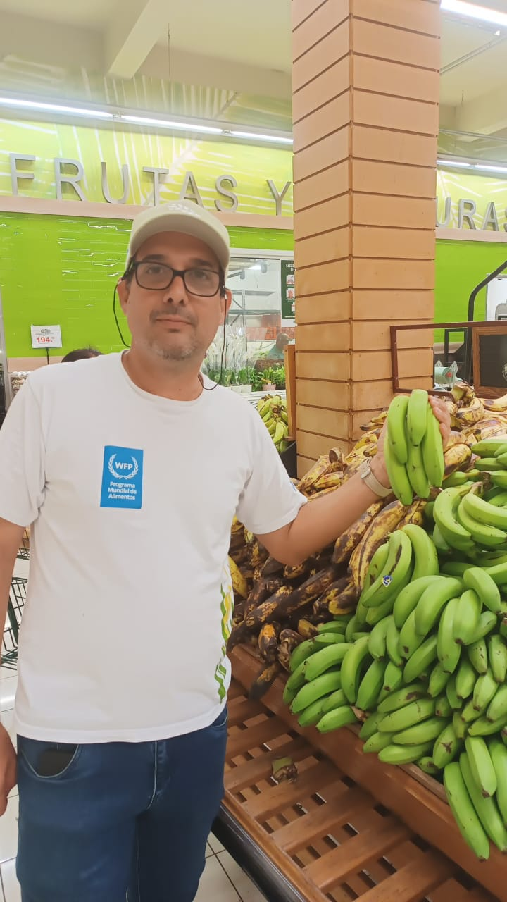
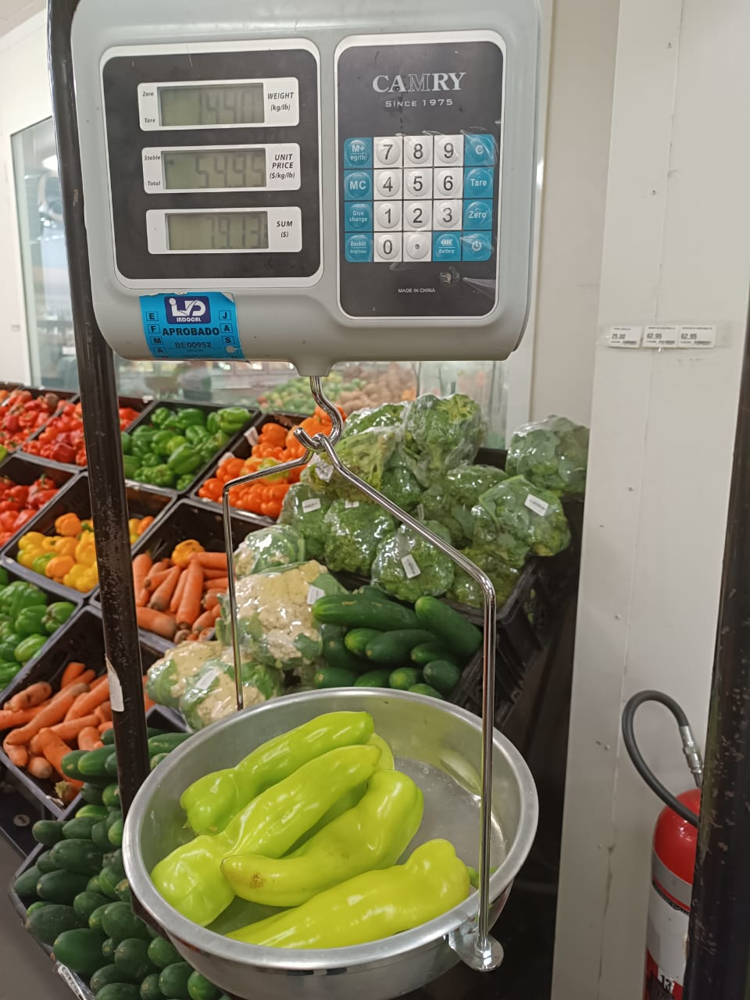

```{r}
#| label: setup
ruta_comun <- c(here::here("reports", "_comun.R"),
                here::here("scripts", "_comun.R"))
source(ruta_comun[file.exists(ruta_comun)][1])

library(ggplot2)

AZUL <- "#2c5364"; AZUL_C <- "#7ba3bd"; GRIS <- "#c9d3da"; ACENTO <- "#c0623c"

tema <- function(base = 16) {
  theme_minimal(base_size = base) +
    theme(panel.grid.minor = element_blank(),
          panel.grid.major.x = element_blank(),
          panel.grid.major.y = element_line(colour = "#eef2f4"),
          axis.title = element_text(colour = "#5a6b76", size = rel(0.85)),
          plot.title = element_text(face = "bold", colour = "#1a3a4a", size = rel(0.95)),
          legend.position = "none")
}

d     <- cargar_consumo()
sec2  <- d$sec2  |> marcar_elegible()
sec3a <- d$sec3a |> marcar_elegible()
gpe   <- cargar_gramos_por_ema() |> marcar_vehiculo()
ema   <- leer_limpio(file.path(RUTA_CLEAN, "data_ema_hogar.csv"))
hog   <- n_distinct(gpe$id_hogar_unico)
comp  <- cargar_composicion()
NUT   <- c("energia_kcal","hierro_mg","folato_mcg_dfe","vitamina_a_mcg_rae")

f_var <- file.path(RUTA_CLEAN, "comparacion_variantes_seccion.csv")
variantes <- if (file.exists(f_var)) leer_limpio(f_var) else NULL
```

## Marco metodológico

Estimación de **consumo aparente** a nivel de hogar a partir de encuestas de
gastos y consumo, con normalización por **Equivalente de Mujer Adulta**.

$$\text{Consumo diario (g)} \;=\; \frac{Q \times FC \times PC}{PM}$$

::: {style="font-size:0.86em; color:#5a6b76; margin-top:-0.4em;"}
$Q$ cantidad adquirida · $FC$ factor de conversión a gramos · $PC$ porción
comestible · $PM$ período de medición
:::

<br>

::: {style="font-size:0.93em;"}
**Datos:** Encuesta Nacional de Gastos e Ingresos de los Hogares 2018, Banco
Central de la República Dominicana. Secciones 2 y 3A — existencias y
adquisiciones de alimentos en el hogar. Microdatos de acceso público.
:::

## Desarrollo del procedimiento

**Implementado** — cadena completa de cálculo y normalización por EMA sobre los
8.892 hogares de la muestra
([`03_transform.R`](https://github.com/maicel1978/analisis_ENGIH2018/blob/main/scripts/03_transform.R) ·
[`04_equivalente_adulto.R`](https://github.com/maicel1978/analisis_ENGIH2018/blob/main/scripts/04_equivalente_adulto.R)).

<br>

**Extensiones desarrolladas en el marco de este análisis**

- Cobertura poblacional de los vehículos de fortificación —
  [informe](https://github.com/maicel1978/analisis_ENGIH2018/blob/main/reports/R3_cobertura_vehiculos.qmd)
- Ingesta bajo escenarios alternativos de fortificación —
  [informe](https://github.com/maicel1978/analisis_ENGIH2018/blob/main/reports/R4_escenarios_fortificacion.qmd) ·
  [definición de escenarios](https://github.com/maicel1978/analisis_ENGIH2018/blob/main/reports/_comun.R)
- Distribución de la ingesta por capacidad de gasto —
  [informe](https://github.com/maicel1978/analisis_ENGIH2018/blob/main/reports/R5_equidad.qmd)

<br>

::: {style="font-size:0.88em;"}
La tercera extensión arrojó el resultado de mayor interés: **la fortificación
del arroz reduce la razón de ingesta de folato entre quintiles extremos de 1,21
a 1,01**, por consumo transversal del vehículo.
:::

## Documentación disponible

::: {style="font-size:0.93em;"}
**Informes** — [factibilidad](INFORME_factibilidad.html) ·
[calidad de datos](R1_calidad_datos.html) ·
[modelo de base](R2_modelo_base.html) ·
[cobertura de vehículos](R3_cobertura_vehiculos.html) ·
[escenarios](R4_escenarios_fortificacion.html) ·
[equidad](R5_equidad.html)

**Código** —
[pipeline completo](https://github.com/maicel1978/analisis_ENGIH2018/tree/main/scripts)
· [definiciones compartidas](https://github.com/maicel1978/analisis_ENGIH2018/blob/main/reports/_comun.R)

**Decisiones** —
[bitácora del proyecto](https://github.com/maicel1978/analisis_ENGIH2018/blob/main/docs/hoja-de-ruta.md)
· [registro de auditoría del mapeo](https://github.com/maicel1978/analisis_ENGIH2018/tree/main/data/auditoria)

**Datos auxiliares** —
[crosswalk y factores de conversión](https://github.com/maicel1978/analisis_ENGIH2018/tree/main/data/raw)
· [evidencia de campo](https://github.com/maicel1978/analisis_ENGIH2018/tree/main/media)
:::

<br>

::: {style="font-size:0.86em; color:#5a6b76;"}
**NOTA:** El análisis es reproducible en su totalidad a partir de los
microdatos públicos. El proyecto está en desarrollo activo: las cifras se
recalculan al compilar cada documento, de modo que las versiones sucesivas
reflejan el estado de los datos en cada momento.
:::

# 1 · Qué entra al análisis {background-color="#2c5364"}

## Cobertura del cálculo

```{r}
#| label: tbl-cobertura
#| tbl-cap: "Observaciones registradas y observaciones que completan la cadena de cálculo, según sección del cuestionario. República Dominicana, 2018"
bind_rows(sec2, sec3a) |>
  group_by(Sección = seccion) |>
  summarise(n_obs = n(), n_ok = sum(entra_calculo), .groups = "drop") |>
  transmute(Sección,
            `Observaciones` = format(n_obs, big.mark = "."),
            `Completan el cálculo` = format(n_ok, big.mark = "."),
            `Cobertura (%)` = fmt(100 * n_ok / n_obs)) |>
  tabla(fuente = NULL, notas = paste("Una observación completa el cálculo cuando dispone de",
                      "cantidad, factor de conversión y porción comestible."))
```


El cálculo requiere cantidad, factor de conversión a gramos y porción
comestible. La exclusión se concentra en el factor de conversión: unidades de
mercado sin peso publicado.

El informe de calidad de datos desglosa las exclusiones alimento por alimento.

## Pesos por unidad no publicados

::: {.columns}
::: {.column width="46%"}

:::
::: {.column width="54%"}
::: {style="font-size:0.95em;"}
Las tablas de composición no registran el peso de las presentaciones
comerciales locales.

<br>

Pesaje directo en punto de venta: **cilantro 220 g** por bolsa, **ají cubanela
288 g**.

<br>

Pendiente por esta vía: plátano y guineo, **16.400 observaciones**.
:::
:::
:::

## Un caso sin solución disponible

::: {.columns}
::: {.column width="46%"}

:::
::: {.column width="54%"}
::: {style="font-size:0.95em;"}
**Caldo concentrado en cubos — 18.087 observaciones.**

<br>

La etiqueta declara peso por unidad y contenido de sodio, pero no el perfil de
micronutrientes. No se identificó equivalente adecuado en INCAP.

<br>

Queda sin asignar: se prefiere la pérdida de cobertura a atribuir una
composición no verificada.
:::
:::
:::

## La tabla puente

```{r}
#| label: tbl-crosswalk
#| tbl-cap: "Estructura de la correspondencia entre alimentos de la encuesta y tablas de composición. República Dominicana, 2018"

cw <- cargar_crosswalk("Cuest. B Sec 3A")

cw |>
  filter(!is.na(enhance_id)) |>
  slice(1:3) |>
  transmute(`Alimento (ENGIH)` = descripcion_engih,
            `Código` = enhance_id,
            `Fuente` = fuente,
            `Equivalencia` = tipo_equivalencia,
            `Validado` = validado) |>
  tabla(fuente = NULL,
        notas = paste("Cada registro vincula un alimento de la encuesta con una",
                      "entrada de tabla de composición, declarando su procedencia",
                      "y si la correspondencia es directa o por criterio."))
```

::: {style="font-size:0.9em; margin-top:0.4em;"}
Un mismo análisis integra dos tablas de composición de distinta procedencia.
La columna de fuente mantiene la trazabilidad de cada valor.
:::

## Cómo entra una revisión al análisis

```{r}
#| label: tbl-estado-cw
#| tbl-cap: "Estado de la correspondencia de alimentos de la Sección 3A. República Dominicana, 2018"

val <- function(x) toupper(trimws(as.character(x))) %in% c("TRUE","VERDADERO","1")

n_tot <- nrow(cw)
n_map <- sum(!is.na(cw$enhance_id))
n_val <- sum(!is.na(cw$enhance_id) & val(cw$validado))

tibble(
  `Estado` = c("Mapeado y validado — entra al cálculo",
               "Pendiente de mapeo o validación"),
  `Alimentos` = format(c(n_val, n_tot - n_val), big.mark = "."),
  `%` = fmt(100 * c(n_val, n_tot - n_val) / n_tot)
) |>
  tabla(fuente = NULL,
        notas = paste("Un registro contribuye al cálculo únicamente cuando",
                      "dispone de código de composición y está marcado como",
                      "validado."))
```

::: {style="font-size:0.9em; margin-top:0.4em;"}
La validación no es un trámite: **es lo que habilita el dato**. Al validar un
alimento pendiente, las cifras de todos los informes se actualizan al
recompilar, sin intervención manual.

Cada modificación queda registrada con su valor anterior, el nuevo y su
justificación —
[registro de auditoría](https://github.com/maicel1978/analisis_ENGIH2018/tree/main/data/auditoria).
:::

## Contraste con un análisis independiente

::: {.columns}
::: {.column width="52%"}
```{r}
#| label: tbl-validacion
#| tbl-cap: "Alimentos de mayor participación en el gasto familiar y su presencia entre los de mayor volumen consumido. República Dominicana, 2018"
tibble(
  `Orden` = 1:10,
  `Alimento` = c("Pollo fresco", "Arroz", "Agua purificada", "Plátano verde",
                 "Salami", "Refrescos", "Huevos", "Leche líquida",
                 "Aceite de soya", "Pan sobado"),
  `Presente` = c("Sí","Sí","—","Sí","Sí","Sí","Sí","Sí","Sí","Sí")
) |> tabla(
  fuente = paste("Fuente de la columna de gasto: del Rosario P. El consumo de",
                 "alimentos en República Dominicana. IDIAF, 2021, sobre",
                 "ponderaciones del IPC del Banco Central."),
  notas  = "El agua purificada se excluye del análisis nutricional.")
```


:::
::: {.column width="48%"}
::: {style="font-size:0.88em;"}
El [IDIAF](https://wp.sodiaf.org.do/publicaciones/wp-content/uploads/2023/02/El-consumo-de-alimentos-RD.pdf)
analizó la misma encuesta por participación en el gasto, a partir de las
ponderaciones del IPC del Banco Central.

Ocho de sus diez primeros figuran entre los de mayor volumen aquí. El agua
purificada se excluye por no aportar nutrientes.

La ingesta estimada equivale a cerca del 70% de la disponibilidad que reportan
las hojas de balance de FAO, dentro del rango habitual para encuestas de
hogares.
:::
:::
:::

# 2 · Vehículos de fortificación {background-color="#2c5364"}

## Cobertura por vehículo

```{r}
#| label: fig-vehiculos
#| fig-cap: "Proporción de hogares que consumen cada vehículo de fortificación. República Dominicana, 2018"
#| fig-width: 10.5
#| fig-height: 3.6

marco <- tibble(id_hogar_unico = unique(gpe$id_hogar_unico))
for (v in unique(na.omit(gpe$vehiculo))) {
  cons <- gpe |> filter(vehiculo == v) |> distinct(id_hogar_unico) |> pull()
  marco[[v]] <- marco$id_hogar_unico %in% cons
}
dis_veh <- diseno_muestral(marco)

cob <- bind_rows(lapply(unique(na.omit(gpe$vehiculo)), function(v) {
  estimar_proporcion(dis_veh, !!rlang::sym(v)) |>
    transmute(vehiculo = v, p, lo = p_low, hi = p_upp)
})) |>
  mutate(vehiculo = reorder(vehiculo, p))

ggplot(cob, aes(p, vehiculo)) +
  geom_errorbarh(aes(xmin = lo, xmax = hi), height = 0.14, colour = "#93a2ad") +
  geom_point(colour = AZUL, size = 3.4) +
  scale_x_continuous(limits = c(0, 100), labels = function(x) paste0(x, "%")) +
  labs(x = "Hogares que lo consumen (%)", y = NULL) +
  tema()
```

::: {.notapie}
**NOTA:** Estimaciones ponderadas con el diseño muestral complejo de la encuesta (8 estratos, 933 UPM, factor de expansión por hogar); intervalos por linealización de Taylor. Barras horizontales: IC 95%. EMA: Equivalente de Mujer Adulta. IC: intervalo de confianza. UPM: unidad primaria de muestreo.
:::


## Definición del vehículo trigo

```{r}
#| label: tbl-trigo
#| tbl-cap: "Alcance poblacional del vehículo trigo según la definición del indicador. República Dominicana, 2018"
gpe_amp <- cargar_gramos_por_ema() |> marcar_vehiculo(ampliado = TRUE)
h_est <- gpe |> filter(vehiculo == "Harina de trigo") |> distinct(id_hogar_unico) |> nrow()
h_amp <- gpe_amp |> filter(vehiculo == "Trigo y derivados") |> distinct(id_hogar_unico) |> nrow()

tibble(
  `Definición del indicador` = c("Harina de trigo como producto",
                                 "Harina de trigo y sus derivados"),
  `Hogares`       = format(c(h_est, h_amp), big.mark = "."),
  `Alcance (%)`   = fmt(100 * c(h_est, h_amp) / hog)
) |> tabla(fuente = NULL, notas = paste("Derivados: pan, galletas, pastas y productos afines de",
                         "harina de trigo. Excluye derivados de maíz y arroz."))
```


Ningún hogar declara harina en existencias y una minoría registra su compra,
mientras los derivados aparecen en la mayoría. La fortificación se aplica en el
molino: un indicador construido sobre harina mide un insumo intermedio.

::: {style="font-size:0.85em; color:#5a6b76;"}
La norma es obligatoria para panificación y voluntaria para pastas y galletas.
Sin factores de receta, la cifra ampliada mide alcance, no gramos de harina.
:::

# 3 · Escenarios y equidad {background-color="#2c5364"}

## Ingesta según qué se fortifique

```{r}
#| label: fig-escenarios
#| fig-cap: "Ingesta mediana de hierro y folato por Equivalente de Mujer Adulta y día, según escenario de fortificación. República Dominicana, 2018"
#| fig-width: 10.5
#| fig-height: 3.5

calc <- function(nombre) {
  sw <- ESCENARIOS |> filter(escenario == nombre) |> select(vehiculo, eid_esc = enhance_id)
  gpe |> left_join(sw, by = "vehiculo") |>
    mutate(eid = coalesce(eid_esc, as.numeric(enhance_id))) |>
    left_join(comp, by = c("eid" = "enhance_id")) |>
    mutate(across(all_of(NUT), ~ .x * Gramos_por_EMA_dia / 100)) |>
    group_by(id_hogar_unico) |>
    summarise(across(all_of(NUT), ~ sum(.x, na.rm = TRUE)), .groups = "drop") |>
    mutate(escenario = gsub("^[0-9]\\. ", "", nombre))
}
res <- bind_rows(lapply(unique(ESCENARIOS$escenario), calc))

res |> group_by(escenario) |>
  summarise(Hierro = median(hierro_mg), Folato = median(folato_mcg_dfe),
            .groups = "drop") |>
  tidyr::pivot_longer(-escenario, names_to = "nut", values_to = "v") |>
  ggplot(aes(escenario, v)) +
  geom_col(fill = AZUL_C, width = 0.5) +
  geom_text(aes(label = fmt(v)), vjust = -0.35, size = 4, colour = "#44555f") +
  scale_y_continuous(expand = expansion(mult = c(0, 0.2))) +
  facet_wrap(~nut, scales = "free_y",
             labeller = as_labeller(c(Hierro = "Hierro (mg)",
                                      Folato = "Folato (µg DFE)"))) +
  labs(x = NULL, y = NULL) +
  tema(14) +
  theme(strip.text = element_text(face = "bold", colour = "#1a3a4a"),
        axis.text.x = element_text(size = rel(0.85)))
```

::: {.notapie}
**NOTA:** Los escenarios sustituyen el código de
composición de los vehículos; el resto de los alimentos permanece sin cambio.
EMA: Equivalente de Mujer Adulta. DFE: equivalentes dietéticos de folato.
:::

El arroz enriquecido aporta 4,36 mg de hierro por 100 g y la harina enriquecida
4,64. La diferencia de efecto proviene del alcance: 88% de los hogares consumen
arroz, 8% harina.

## Gradiente social del folato

```{r}
#| label: fig-equidad
#| fig-cap: "Ingesta mediana de folato por Equivalente de Mujer Adulta y día, según quintil de gasto del hogar y escenario de fortificación. República Dominicana, 2018"
#| fig-width: 10.5
#| fig-height: 3.4

eq <- bind_rows(lapply(unique(ESCENARIOS$escenario), function(e) {
  estimar(diseno_muestral(calc(e)), folato_mcg_dfe, por = "quintil") |>
    mutate(escenario = gsub("^[0-9]\\. ", "", e))
}))

ggplot(eq, aes(factor(quintil), mediana, group = escenario)) +
  geom_line(colour = AZUL, linewidth = 1) +
  geom_point(colour = AZUL, size = 2.4) +
  facet_wrap(~escenario, scales = "free_y", nrow = 1) +
  labs(x = "Quintil de gasto del hogar",
       y = "Folato (µg DFE por EMA y día)") +
  tema(14) +
  theme(strip.text = element_text(face = "bold", colour = "#1a3a4a"))
```

::: {.notapie}
**NOTA:** Estimaciones ponderadas con el diseño muestral complejo de la encuesta (8 estratos, 933 UPM, factor de expansión por hogar); intervalos por linealización de Taylor. Quintil de gasto según la clasificación de la propia encuesta. DFE: equivalentes dietéticos de folato. EMA: Equivalente de Mujer Adulta. IC: intervalo de confianza. UPM: unidad primaria de muestreo.
:::


Razón entre el quintil de mayor y el de menor gasto: 1,21 sin fortificación,
1,21 fortificando solo harina, 1,01 incorporando el arroz.

## Consumo de arroz por quintil

::: {.columns}
::: {.column width="46%"}
```{r}
#| label: tbl-arroz-q
#| tbl-cap: "Consumo mediano de arroz por Equivalente de Mujer Adulta y día, según quintil de gasto del hogar. República Dominicana, 2018"
arroz <- gpe |> filter(vehiculo == "Arroz") |>
  group_by(id_hogar_unico) |>
  summarise(g = sum(Gramos_por_EMA_dia, na.rm = TRUE), .groups = "drop")

estimar(diseno_muestral(arroz), g, por = "quintil") |>
  transmute(`Quintil de gasto` = quintil,
            `Mediana (g)` = fmt(mediana),
            `IC 95%` = ic(media_low, media_upp)) |>
  tabla(fuente = NULL, notas = c(NOTA_DISENO,
                  paste("Gramos por Equivalente de Mujer Adulta y día, entre",
                        "hogares consumidores."),
                  NOTA_EMA))
```


:::
::: {.column width="54%"}
::: {style="font-size:0.9em;"}
El consumo es equivalente entre el segundo y el quinto quintil.

Con cantidades similares, el nutriente añadido entra en cantidades absolutas
similares. Como la ingesta total de los hogares de mayor gasto es superior por
otras vías, el aporte del vehículo pesa más en la dieta de los hogares de menor
gasto.
:::
:::
:::

# 4 · Definiciones pendientes {background-color="#8b5a2b"}

## Secciones 2 y 3A

```{r}
#| label: tbl-variantes
#| tbl-cap: "Ingesta aparente mediana por Equivalente de Mujer Adulta y día, según las secciones del cuestionario incluidas. República Dominicana, 2018"
if (!is.null(variantes)) {
  variantes |> arrange(variante) |>
    transmute(`Secciones incluidas` = variante,
              `Hogares (n)` = hogares,
              `Energía (kcal)` = fmt(energia_mediana, 0),
              `Hierro (mg)` = fmt(hierro_mediana),
              `Folato (µg DFE)` = fmt(folato_mediana, 0)) |>
    tabla(fuente = NULL, notas = c(paste("Valores medianos por Equivalente de Mujer Adulta y día.",
                          "Sección 2: existencias en el hogar.",
                          "Sección 3A: adquisiciones diarias."),
                    NOTA_EMA))
}
```


Cada sección por separado arroja cerca de la mitad del requerimiento
energético. Ambas registran arroz, aceite, azúcar y leche, de modo que su suma
duplica los almacenables: de los 572 hogares con energía implausible, 223 se
explican por ese solapamiento.

El refinamiento aplicable es la disponibilidad neta, con los campos disponibles
en la Sección 2.

## Línea base y fuentes de composición

**Línea base de fortificación.** El mapeo actual no corresponde a ningún
escenario real de política dominicana: sobrestima el folato y subestima la
vitamina A. Los tres escenarios están calculados.

**Fuentes de composición.** Alimentos sin equivalencia en INCAP ni FNDDS. El de
mayor peso es el caldo concentrado, con 18.087 observaciones.

**Requerimientos de referencia.** El valor aplicable depende de la referencia
adoptada y, en hierro, de la biodisponibilidad supuesta.

## Verificaciones pendientes

| | |
|---|---|
| Cerveza clara | 177.140 g en 512 hogares. Posible error de factor de conversión |
| Menores de 1 año | Valor provisional de 600 kcal/día, sin contrastar con FAO/OMS/UNU |
| Embarazo y lactancia | Sin ajuste; falta confirmar si el módulo demográfico lo permite |
| Atípicos por hogar | 572 hogares marcados, sin tratamiento definido |

## Trabajo pendiente

| | |
|---|---|
| Plátano y guineo | Cobertura de Sección 3A: 76% → ~81% |
| Disponibilidad neta | Corrige el solapamiento entre secciones |
| Atípicos por hogar | Depende de lo anterior |
| Factores de receta | Cuantificar el aporte por vía de derivados de trigo |

<br>

::: {style="font-size:0.88em; color:#5a6b76;"}
Detalle y guía de continuidad en el
[informe de factibilidad](INFORME_factibilidad.html).
:::

## Líneas en curso

**Tableros de apoyo a la decisión.** Estado de la base de datos y comparación de
escenarios, en formato autocontenido y sin dependencia de servidor.

**Manuscrito.** Redacción en curso sobre la definición del indicador de
cobertura cuando el vehículo fortificado se consume transformado — un problema
que no es específico de República Dominicana.

**Módulos formativos.** Integración de este procedimiento como caso práctico
reproducible, en el marco del proyecto de capacitación.

<br>

::: {style="font-size:0.86em; color:#5a6b76;"}
Todo el desarrollo permanece accesible y auditable en
[`github.com/maicel1978/analisis_ENGIH2018`](https://github.com/maicel1978/analisis_ENGIH2018).
:::
