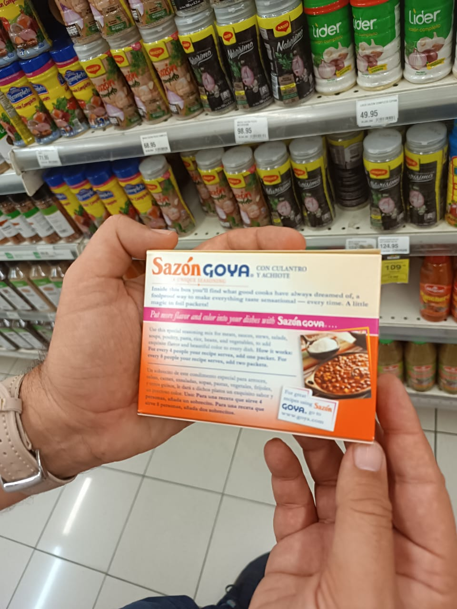

```{r}
#| label: setup
ruta_comun <- c(here::here("reports", "_comun.R"),
                here::here("scripts", "_comun.R"))
source(ruta_comun[file.exists(ruta_comun)][1])

library(ggplot2)

AZUL   <- "#2c5364"
AZUL_C <- "#4a7c9b"
GRIS   <- "#b8c4cc"
ACENTO <- "#c0623c"
VERDE  <- "#3d7068"

tema_pres <- function(base = 17) {
  theme_minimal(base_size = base) +
    theme(
      panel.grid.minor   = element_blank(),
      panel.grid.major.y = element_line(colour = "#e8edf0"),
      panel.grid.major.x = element_blank(),
      axis.title         = element_text(colour = "#5a6b76", size = rel(0.85)),
      axis.text          = element_text(colour = "#33444f"),
      plot.title         = element_text(face = "bold", colour = "#1a3a4a", size = rel(1.05)),
      plot.subtitle      = element_text(colour = "#5a6b76", size = rel(0.85)),
      plot.caption       = element_text(colour = "#93a2ad", size = rel(0.7), hjust = 0),
      legend.position    = "top",
      legend.title       = element_blank(),
      plot.margin        = margin(6, 14, 6, 6)
    )
}

gpe <- cargar_gramos_por_ema() |> marcar_vehiculo()
ema <- leer_limpio(file.path(RUTA_CLEAN, "data_ema_hogar.csv"))
hog <- n_distinct(gpe$id_hogar_unico)

ing <- leer_limpio(file.path(RUTA_CLEAN, "data_ingesta_micronutrientes_hogar.csv"))
ing_sum <- if ("variante" %in% names(ing)) filter(ing, variante == "Sec 2 + Sec 3A") else ing

f_var <- file.path(RUTA_CLEAN, "comparacion_variantes_seccion.csv")
variantes <- if (file.exists(f_var)) leer_limpio(f_var) else NULL
```

## {.center}

::: {style="text-align:center; margin-top:1.2em;"}
Una encuesta de **2018**.

Ya levantada, ya publicada, ya analizada para otros fines.

::: {.fragment style="margin-top:1.2em; font-size:1.15em;"}
**¿Sirve para evaluar un programa de fortificación de alimentos?**
:::

::: {.fragment style="margin-top:1.4em; font-size:0.8em; color:#5a6b76;"}
Si la respuesta es sí, la implicación no es solo dominicana.
:::
:::

---

## Cómo está organizado esto

::: {.incremental}
1. ¿Qué come realmente un hogar, y cómo podemos saberlo?
2. ¿A cuántos hogares llega cada alimento fortificable?
3. Si la harina llega al 8%, ¿por dónde llega entonces la fortificación?
4. ¿Y si se fortificara el arroz?
5. ¿Qué haría falta para repetir esto en otro país?
:::

::: {.fragment style="margin-top:1em; font-size:0.85em; color:#5a6b76;"}
Todas las cifras se calculan al compilar este documento. El botón `</>` de cada
lámina muestra el código que la produce.
:::

# 1 {background-color="#2c5364"}

::: {style="color:#f0f4f7; font-size:1.15em;"}
¿Qué come realmente un hogar, y cómo podemos saberlo?
:::

## El problema de partida

La encuesta no pregunta *"¿cuánto arroz comió usted?"*.

Pregunta **qué compró el hogar y cuánto gastó**.

::: {.fragment}
Para llegar de ahí a gramos de alimento hace falta una cadena de conversiones.
Cada eslabón puede romperse.
:::

::: {.fragment style="margin-top:1em;"}
$$\text{Consumo diario (g)} = \frac{Q \times FC \times PC}{PM}$$
:::

::: {.fragment style="font-size:0.8em; color:#5a6b76;"}
Cantidad · Factor de conversión a gramos · Porción comestible · Período de medición
:::

## Dónde se rompe la cadena

```{r}
#| label: fig-embudo
#| fig-width: 12
#| fig-height: 5

d <- cargar_consumo()
s3 <- d$sec3a |> marcar_elegible()

emb <- tibble(
  etapa = factor(
    c("Registradas", "Con cantidad", "+ factor\nde conversión",
      "+ tabla de\ncomposición", "+ porción\ncomestible", "Entran al\ncálculo"),
    levels = c("Registradas", "Con cantidad", "+ factor\nde conversión",
               "+ tabla de\ncomposición", "+ porción\ncomestible", "Entran al\ncálculo")
  ),
  n = c(
    nrow(s3),
    sum(s3$tiene_Q),
    sum(s3$tiene_Q & s3$tiene_fc),
    sum(s3$tiene_Q & s3$tiene_fc & s3$tiene_enhance),
    sum(s3$tiene_Q & s3$tiene_fc & s3$tiene_enhance & s3$tiene_pc),
    sum(s3$entra_calculo)
  )
) |>
  mutate(pct = 100 * n / max(n),
         col = ifelse(grepl("Entran", etapa), AZUL, AZUL_C))

ggplot(emb, aes(etapa, n, fill = col)) +
  geom_col(width = 0.62) +
  geom_text(aes(label = paste0(format(n, big.mark = "."), "\n", round(pct), "%")),
            vjust = -0.25, size = 4.2, colour = "#33444f", lineheight = 0.95) +
  scale_fill_identity() +
  scale_y_continuous(expand = expansion(mult = c(0, 0.2)), labels = NULL) +
  labs(x = NULL, y = NULL,
       title = "Sección 3A — adquisiciones diarias",
       caption = "Cada barra aplica un requisito más de la fórmula.") +
  tema_pres() +
  theme(axis.text.x = element_text(size = rel(0.78), lineheight = 0.9))
```

::: {.fragment style="font-size:0.82em;"}
La pérdida principal **no** está en el mapeo a tablas de composición. Está en
los factores de conversión: unidades como *"un mazo"*, *"una docena"*, *"un
racimo"*.
:::

## Y ahí la tabla internacional no alcanza

::: {.columns}
::: {.column width="52%"}

:::
::: {.column width="48%"}
::: {style="font-size:0.92em;"}
INCAP no tiene el peso de una bolsa de cilantro dominicana.

::: {.fragment}
Fui al mercado y pesé.

- Cilantro — 220 g por bolsa
- Ají cubanela — 288 g
:::

::: {.fragment style="margin-top:0.8em; color:#5a6b76;"}
Sin ese dato, esas observaciones sencillamente no entran al cálculo.
:::
:::
:::
:::

## A veces la respuesta es que no se puede

::: {.columns}
::: {.column width="44%"}

:::
::: {.column width="56%"}
::: {style="font-size:0.9em;"}
**Caldo concentrado — 18.087 observaciones.**

La mayor pérdida individual de todo el análisis.

::: {.fragment}
Verifiqué la etiqueta en tienda: 1 cubito = 10 g, 2.320 mg de sodio.
:::

::: {.fragment}
Pero la etiqueta no trae el perfil de micronutrientes, y no hay un equivalente
claro en INCAP.
:::

::: {.fragment style="margin-top:0.7em; color:#c0623c;"}
**Lo dejé sin asignar.** Prefiero perder 18.000 observaciones a inventarles una
composición.
:::
:::
:::
:::

## Un supuesto que casi doy por bueno

El diseño declara **7 días** de observación. Pero el 39% de los hogares tiene
registros en menos días.

::: {.fragment}
Un hogar con 3 días: ¿lo observaron 3 días, o lo observaron 7 y no compró nada
en 4?
:::

::: {.fragment style="margin-top:0.8em;"}
Si fuera lo segundo, dividir entre 3 **inflaría su consumo un 133%**. Y yo
estaba dividiendo entre 3.
:::

## Lo verifiqué, y mi sospecha era falsa

```{r}
#| label: fig-pm
#| fig-width: 11.5
#| fig-height: 4.6

s3d <- leer_limpio(file.path(RUTA_CLEAN, "data_sec3a_consumo.csv"))

pm <- s3d |>
  distinct(id_hogar_unico, dias_observados_hogar) |>
  inner_join(ing_sum, by = "id_hogar_unico") |>
  filter(dias_observados_hogar <= 7) |>
  group_by(dias = dias_observados_hogar) |>
  summarise(mediana = median(energia_kcal), .groups = "drop")

ref7 <- pm$mediana[pm$dias == 7]
esperado <- tibble(dias = 1:7, mediana = ref7 * 7 / (1:7))

ggplot(pm, aes(dias, mediana)) +
  geom_line(data = esperado, colour = GRIS, linetype = "22", linewidth = 1) +
  geom_point(data = esperado, colour = GRIS, size = 2.4) +
  geom_line(colour = AZUL, linewidth = 1.4) +
  geom_point(colour = AZUL, size = 4) +
  annotate("text", x = 2.2, y = esperado$mediana[2] * 0.9,
           label = "Lo que se vería si el\ndenominador inflara",
           colour = "#93a2ad", size = 4, hjust = 0, lineheight = 0.95) +
  annotate("text", x = 3.5, y = ref7 * 1.8,
           label = "Lo observado", colour = AZUL, size = 4.6, fontface = "bold") +
  scale_x_continuous(breaks = 1:7) +
  scale_y_continuous(labels = function(x) format(round(x), big.mark = ".")) +
  labs(x = "Días con registro en el hogar",
       y = "Energía mediana (kcal por EMA y día)",
       title = "La ingesta mediana es invariante al número de días observados",
       caption = "Si el denominador inflara, los hogares de un día mostrarían unas siete veces más.") +
  tema_pres()
```

::: {.fragment style="font-size:0.85em;"}
El denominador es correcto. **Pero no lo sabía hasta probarlo** — y el test era
barato comparado con publicar una cifra inflada.
:::

## Qué se puede afirmar, entonces

```{r}
#| label: tbl-cob
bind_rows(d$sec2 |> marcar_elegible(), d$sec3a |> marcar_elegible()) |>
  group_by(Sección = seccion) |>
  summarise(Observaciones = n(), `Entran al cálculo` = sum(entra_calculo),
            .groups = "drop") |>
  mutate(Cobertura = pct(`Entran al cálculo`, Observaciones)) |>
  kable(format.args = list(big.mark = "."))
```

::: {.fragment}
No pretendo que sea el 100%. Pretendo **saber exactamente cuánto es y de qué
está hecho lo que falta**.
:::

::: {.fragment style="margin-top:0.7em; color:#5a6b76; font-size:0.86em;"}
Regla que aplico en todo lo que sigue: ninguna cifra se cita sin su cobertura.
:::

# 2 {background-color="#2c5364"}

::: {style="color:#f0f4f7; font-size:1.15em;"}
¿A cuántos hogares llega cada alimento fortificable?
:::

## Cobertura de los cuatro vehículos

```{r}
#| label: fig-vehiculos
#| fig-width: 11.5
#| fig-height: 4.8

cob <- gpe |>
  filter(!is.na(vehiculo)) |>
  distinct(id_hogar_unico, vehiculo) |>
  count(vehiculo) |>
  mutate(p = 100 * n / hog,
         vehiculo = reorder(vehiculo, p),
         col = ifelse(p < 20, ACENTO, AZUL_C))

ggplot(cob, aes(p, vehiculo)) +
  geom_segment(aes(x = 0, xend = p, yend = vehiculo, colour = col), linewidth = 2.6) +
  geom_point(aes(colour = col), size = 9) +
  geom_text(aes(label = paste0(round(p, 1), "%")), colour = "white",
            size = 3.3, fontface = "bold") +
  scale_colour_identity() +
  scale_x_continuous(limits = c(0, 100), labels = function(x) paste0(x, "%")) +
  labs(x = "Hogares que lo consumen", y = NULL,
       title = "Alcance de los vehículos de fortificación",
       caption = paste0("Sobre ", format(hog, big.mark = "."), " hogares con consumo calculado.")) +
  tema_pres()
```

## Aquí me detuve

::: {style="font-size:1.05em;"}
Arroz, aceite y azúcar: **entre 78% y 88%**. Lo esperable.

::: {.fragment style="margin-top:0.9em;"}
**La harina de trigo: 8%.**
:::

::: {.fragment style="margin-top:0.9em; color:#5a6b76;"}
Y en la sección de existencias del hogar, **ningún hogar** la registra.
:::

::: {.fragment style="margin-top:1.2em; color:#c0623c;"}
Mi primera reacción fue pensar que estaba midiendo mal. ¿Cómo lo ven ustedes?
:::
:::

# 3 {background-color="#2c5364"}

::: {style="color:#f0f4f7; font-size:1.15em;"}
Si la harina llega al 8%, ¿por dónde llega entonces la fortificación?
:::

## No es un problema de datos

::: {.incremental}
- En República Dominicana la harina **no se compra como harina**
- Se consume ya procesada: pan, galletas, pastas
- La norma obliga a fortificar **en el molino** — esa harina llega dentro del pan
:::

::: {.fragment style="margin-top:1em;"}
**El indicador estaba midiendo un insumo intermedio, no la exposición de la
población al nutriente.**
:::

## Lo que cambia al redefinirlo

```{r}
#| label: fig-trigo
#| fig-width: 10.5
#| fig-height: 4.3

gpe_amp <- cargar_gramos_por_ema() |> marcar_vehiculo(ampliado = TRUE)
h_est <- gpe |> filter(vehiculo == "Harina de trigo") |> distinct(id_hogar_unico) |> nrow()
h_amp <- gpe_amp |> filter(vehiculo == "Trigo y derivados") |> distinct(id_hogar_unico) |> nrow()

td <- tibble(
  def = factor(c("Harina de trigo\ncomo producto", "Harina de trigo\ny sus derivados"),
               levels = c("Harina de trigo\ncomo producto", "Harina de trigo\ny sus derivados")),
  p = c(100 * h_est / hog, 100 * h_amp / hog)
)

ggplot(td, aes(def, p)) +
  geom_col(fill = c(GRIS, VERDE), width = 0.45) +
  geom_text(aes(label = paste0(round(p, 1), "%")), vjust = -0.3,
            size = 7, fontface = "bold", colour = "#1a3a4a") +
  scale_y_continuous(limits = c(0, 100), expand = expansion(mult = c(0, 0.13)),
                     labels = function(x) paste0(x, "%")) +
  labs(x = NULL, y = "Hogares alcanzados",
       title = "La misma población, dos definiciones del indicador") +
  tema_pres()
```

::: {.fragment style="font-size:0.85em;"}
El alcance real del programa de fortificación de harina no es 8%. Es del orden
del 86% — **por una vía que el indicador no estaba mirando**.
:::

## Un detalle que casi arruina el número

Para identificar derivados del trigo, el patrón evidente es buscar *pan*,
*pasta*, *galleta*, *harina*.

::: {.fragment style="margin-top:0.8em;"}
```
"Pasta de tomate"      12.150 observaciones
"Ajo en pasta"
"Harina de maíz", "Maicena"
"Buen pan o castaña"   → fruta de pan, no trigo
```
:::

::: {.fragment style="margin-top:0.8em;"}
**Sin filtro de exclusión, la cifra se infla un 47%.**
:::

::: {.fragment style="font-size:0.82em; color:#5a6b76;"}
Las inclusiones y exclusiones están en un solo archivo, legibles y discutibles:
`reports/_comun.R`
:::

## Lo que esta definición todavía no resuelve

::: {.callout-warning}
No toda la harina de esos productos está fortificada: la norma es obligatoria
para panificación, voluntaria para pastas y galletas.

Y sin **factores de receta** —cuánta harina contiene cada producto— esto sirve
para medir alcance, **no** para estimar gramos de harina consumidos.
:::

::: {.fragment style="margin-top:0.8em;"}
Es decir: el 86% es un **techo** del alcance, y el aporte real en nutrientes
queda pendiente de cuantificar.
:::

# 4 {background-color="#2c5364"}

::: {style="color:#f0f4f7; font-size:1.15em;"}
¿Y si se fortificara el arroz?
:::

## Tres escenarios, porque no sé cuál aplica

No conozco con precisión qué vehículos están sujetos a norma obligatoria en
República Dominicana, con qué nutrientes y en qué niveles.

::: {.fragment}
No es algo que convenga deducir. Así que modelé tres escenarios y presento el
rango.
:::

```{r}
#| label: calc-esc
comp <- cargar_composicion()
NUT <- c("energia_kcal","hierro_mg","folato_mcg_dfe","vitamina_a_mcg_rae")

calc <- function(nombre) {
  sw <- ESCENARIOS |> filter(escenario == nombre) |> select(vehiculo, eid_esc = enhance_id)
  gpe |> left_join(sw, by = "vehiculo") |>
    mutate(eid = coalesce(eid_esc, as.numeric(enhance_id))) |>
    left_join(comp, by = c("eid" = "enhance_id")) |>
    mutate(across(all_of(NUT), ~ .x * Gramos_por_EMA_dia / 100)) |>
    group_by(id_hogar_unico) |>
    summarise(across(all_of(NUT), ~ sum(.x, na.rm = TRUE)), .groups = "drop") |>
    mutate(escenario = nombre)
}
res <- bind_rows(lapply(unique(ESCENARIOS$escenario), calc))
```

## El resultado

```{r}
#| label: fig-escenarios
#| fig-width: 12
#| fig-height: 4.7

e <- res |>
  group_by(escenario) |>
  summarise(Hierro = median(hierro_mg),
            Folato = median(folato_mcg_dfe), .groups = "drop") |>
  tidyr::pivot_longer(-escenario, names_to = "nut", values_to = "v") |>
  mutate(esc = gsub("^[0-9]\\. ", "", escenario),
         col = ifelse(grepl("arroz", esc), AZUL, GRIS))

ggplot(e, aes(esc, v, fill = col)) +
  geom_col(width = 0.55) +
  geom_text(aes(label = round(v, 1)), vjust = -0.3, size = 5,
            fontface = "bold", colour = "#1a3a4a") +
  scale_fill_identity() +
  scale_y_continuous(expand = expansion(mult = c(0, 0.22))) +
  facet_wrap(~nut, scales = "free_y",
             labeller = as_labeller(c(Hierro = "Hierro (mg / EMA / día)",
                                      Folato = "Folato (µg DFE / EMA / día)"))) +
  labs(x = NULL, y = NULL, title = "Ingesta mediana según qué se fortifique") +
  tema_pres() +
  theme(strip.text = element_text(face = "bold", colour = "#1a3a4a", size = rel(0.9)),
        axis.text.x = element_text(size = rel(0.78)))
```

::: {.fragment style="font-size:0.85em;"}
Fortificar solo la harina mueve el hierro de 9,0 a 9,2 mg. Incluir el arroz lo
lleva a 16,2 y multiplica el folato por 3,7.
:::

## Y la explicación no está donde parecía

::: {.columns}
::: {.column width="46%"}
**Contenido de nutrientes**

Arroz enriquecido — 4,36 mg Fe

Harina enriquecida — 4,64 mg Fe

::: {.fragment style="color:#5a6b76; margin-top:0.5em;"}
Prácticamente iguales.
:::
:::
::: {.column width="54%"}
::: {.fragment}
**Alcance y cantidad**

| | Hogares | Consumo |
|---|---|---|
| Arroz | 87,7% | 207,8 g |
| Harina | 8,0% | 31,9 g |
:::
:::
:::

::: {.fragment style="margin-top:1.1em; font-size:1.05em;"}
La eficacia de un programa de fortificación depende tanto del **alcance del
vehículo** como del nutriente añadido.
:::

## Antes de sacar conclusiones

::: {.incremental}
- El escenario *"solo harina"* **subestima** el efecto real: la harina llega vía pan, y eso no está capturado
- No modelé el aceite: los 18 aceites de la tabla INCAP tienen vitamina A = 0, no hay par fortificado / sin fortificar
- El consumo de almacenables está **sobrestimado**, y eso afecta al propio arroz
:::

::: {.fragment style="margin-top:0.8em; color:#c0623c;"}
Lo que sí parece sostenerse: hay una pregunta de política que vale la pena
hacerse sobre un vehículo que llega al 88% de los hogares.
:::

## Una decisión que no puedo tomar solo

```{r}
#| label: tbl-variantes
if (!is.null(variantes)) {
  variantes |> arrange(variante) |>
    transmute(`Qué se incluye` = variante,
              Hogares = hogares,
              `Energía mediana` = round(energia_mediana),
              `Hierro (mg)` = round(hierro_mediana, 1),
              `Folato (µg)` = round(folato_mediana)) |>
    kable(format.args = list(big.mark = "."))
}
```

::: {.fragment}
La encuesta mide el consumo por dos vías: existencias del hogar y adquisiciones
diarias. **Ninguna por separado da un resultado plausible** — unas 1.200 kcal
por EMA es la mitad del requerimiento.
:::

::: {.fragment style="margin-top:0.6em;"}
Pero sumarlas duplica los almacenables: arroz, aceite, azúcar y leche aparecen
en ambas. **De los 572 hogares con energía implausible, 223 nacen de ese
solapamiento.**
:::

::: {.fragment style="margin-top:0.6em; color:#c0623c;"}
La salida probable es la disponibilidad neta — existencias iniciales +
adquisiciones − existencias finales. Los datos están. Pero conviene decidirlo
entre todos.
:::

# 5 {background-color="#2c5364"}

::: {style="color:#f0f4f7; font-size:1.15em;"}
¿Qué haría falta para repetir esto en otro país?
:::

## Lo que resultó ser específico de aquí

::: {.incremental}
- El **crosswalk** de alimentos locales a tablas de composición — lo más costoso, y no es transferible
- Los **factores de conversión** de unidades de mercado: un mazo, una docena, un racimo
- El criterio local: que *cereza* aquí es acerola, que *zapote* es mamey
:::

::: {.fragment style="margin-top:0.9em;"}
**Lo que sí es transferible es el método y la estructura del código.**
:::

## Y lo que quedó abierto

| | |
|---|---|
| Cobertura | Peso por unidad de plátano y guineo → 76% a ~81% |
| Precisión | Diseño muestral complejo → intervalos de confianza reales |
| Equidad | Desagregación por quintil de gasto y zona |
| Método | Disponibilidad neta para alimentos almacenables |
| Abierto | Factores de receta para derivados del trigo |

::: {.fragment style="margin-top:0.7em; font-size:0.85em;"}
Ninguna de las cinco exige rehacer el análisis. Todas están especificadas y con
los datos identificados.
:::

## Volviendo a la pregunta del inicio

::: {style="font-size:1.05em;"}
Una encuesta de gastos de 2018, no diseñada para esto.

::: {.fragment style="margin-top:0.9em;"}
**Sí sirve** — con una cobertura del 76% que se puede declarar, y con
limitaciones que están medidas y no supuestas.
:::

::: {.fragment style="margin-top:0.9em; color:#5a6b76;"}
Y produjo al menos una pregunta de política que no estaba sobre la mesa.
:::

::: {.fragment style="margin-top:1.1em; font-size:0.88em;"}
Lo que queda por discutir es si vale la pena seguir tirando de este hilo, y en
qué dirección.
:::
:::

## {background-color="#2c5364"}

::: {style="text-align:center; margin-top:2.2em; color:#f0f4f7;"}
### Gracias

::: {style="font-size:0.8em; margin-top:1.4em; color:#c8d4dc;"}
Código, datos y el registro de cada decisión:

`github.com/maicel1978/analisis_ENGIH2018`
:::
:::
